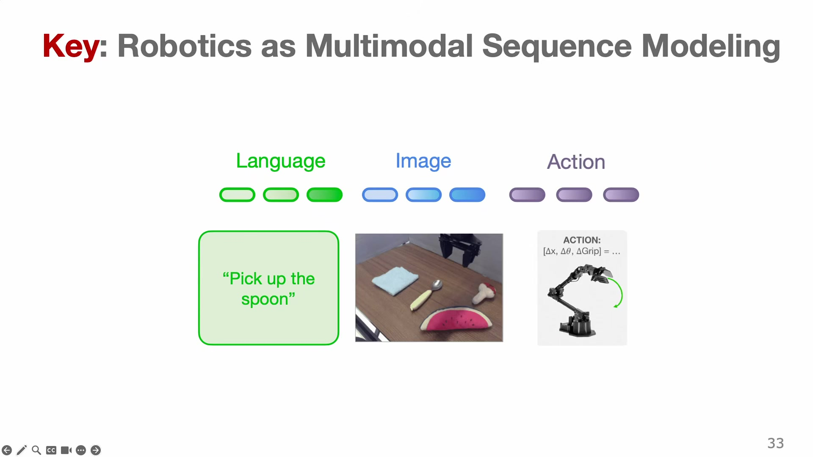

# Introduction: Why Robots Are Hard

A robot arm tried to pick up a coffee mug. It saw the mug as a cloud of 3-D points, computed a grasp from the geometry, closed its fingers — and snapped the mug in two. The hardware was fine. The perception ran. The plan executed with millimeter precision. And the result was a broken mug, because "close your fingers until you hold the cup, but not so hard that you crush it" turns out to be the kind of thing no one had written down. This chapter is about that gap: why robots that can be built cannot yet act on their own in an ordinary kitchen, and why learning from data — rather than hand-written rules — is the field's bet for closing it.

The mug is not a hypothetical. It is from Oier Mees's own PhD work in Freiburg around 2019, and he shows the failure on the first day of the course, on purpose. The point is not that the engineering was bad. The point is that grasping a mug is a member of a class of problems — physical, sensorimotor, open-ended — that has stayed stubbornly hard while other parts of artificial intelligence raced ahead. Naming that class, and explaining why it resists the usual tools, is the first thing we need to do.

## The paradox at the center of robotics

Hans Moravec, a roboticist at Carnegie Mellon, wrote down the puzzle in 1988. The things people find mentally hard — playing grandmaster chess, integrating a function, proving a theorem — turned out to be comparatively easy to automate. A computer beat the world chess champion in 1997. The things people find effortless — recognizing a face, walking over gravel, picking up a mug without crushing it — turned out to be extraordinarily hard. This inversion is now called **Moravec's paradox**.

> **Editor's note.** Moravec's original framing is usually paraphrased: "it is comparatively easy to make computers exhibit adult-level performance on intelligence tests, and difficult or impossible to give them the skills of a one-year-old." The lecture states the paradox and attributes it to Moravec (CMU, 1988) without quoting it; the wording here is standard background.

Why the inversion? One good answer is about data. Abstract reasoning leaves a paper trail — books of chess games, worked proofs, tables of logarithms — that a machine can study. Sensorimotor skill does not. No one has written down, in any form a computer can read, the millions of tiny corrections your hand makes as it lifts a mug. You cannot crawl the internet for it. A toddler learns it by flailing for months; an orangutan learns to use a stick by watching another orangutan. The knowledge is real, but it lives in bodies and experience, not in text. That absence of ready-made data is the thread that runs through this entire book.

Hold onto the shape of the problem: the easy-looking task is the hard one, and the reason it is hard is that the data to learn it from does not already exist in a convenient form. Everything that follows is, in one way or another, a response to that fact.

## The old way, and where it stops

Robots did not wait for machine learning to become useful. They have been working in factories for half a century. It helps to understand exactly how, because the successes and the limits both come from the same design.

The classical recipe is **sense–plan–act**. The robot senses the world through its cameras and range-finders and builds a model of where things are. It plans a sequence of motions through that model. Then it acts, executing the plan with high precision. The very first mobile robot to do this was **Shakey**, built at SRI in 1966. Shakey carried a television camera and bump sensors, and it reasoned about its blocks-world of rooms and doorways before it moved.

> **Editor's note.** The course slides and the lecturer both say "Shakey, Stanford 1966." Shakey was in fact built at SRI International in Menlo Park, which was affiliated with but distinct from Stanford. The date is right; the institution is loosely stated. It is a genuinely important robot for an unrelated reason given in the lecture: the **A\*** search algorithm, still taught in every AI course, was invented to let Shakey plan its routes.

Shakey planned so slowly — minutes to an hour per decision — that it was more a proof of concept than a worker. The industrial robots that followed in the 1970s and 80s kept the sense–plan–act loop but ran it fast and in tightly controlled settings. A welding arm on a car assembly line senses very little, because it does not have to: the car is always in the same place, so the arm can follow a geometric plan in a known map and hit its targets to a fraction of a millimeter. This has been one of the most successful ideas in the history of engineering.

It works because of an assumption, and it fails for the same reason. The assumption is a **closed world**: everything relevant is known, modeled, and fixed in advance. Under that assumption a robot is a state machine, and a state machine is exactly as good as the logic written into it. Move the part two centimeters, change the lighting, hand it an object it has never seen, and it has no way to cope, because coping was never in the program. These robots were, in the lecturer's word, "blind" — not for lack of sensors, but because they had no capacity to adapt to anything the engineer had not foreseen.

You can watch the assumption break. The videos from the DARPA Robotics Challenge in 2015 show state-of-the-art humanoids falling over while trying to open a door or turn a valve. Even Boston Dynamics' Atlas, some of the finest robot hardware ever built, has historically leaned on near-perfect **state estimation** — often with QR codes stuck around the environment so the robot always knows exactly where everything is. Get a few centimeters off, and an impressive backflip becomes an expensive pile of parts on the floor. The precision that makes these machines look superhuman in a demo is also what makes them brittle outside of it.

So the closed-world recipe gives up either generality (the factory arm, which never leaves its cage) or steadiness in the plain sense of not-falling-over (the humanoid, which needs the world pinned down for it). Escaping that trade-off — letting a robot handle the edge cases of a real, unstructured environment — is the problem this course sets itself.

## What "robot learning" means

Here is the definition the course uses, stated plainly on the slide and worth taking literally:

> Robot learning is the study of algorithms that enable a robot to acquire new skills or adapt to an unstructured environment by learning from data and experience, rather than relying on explicit or hand-coded programming.

Read it against the previous section. "Unstructured environment" is the opposite of the closed world. "Learning from data and experience" is the opposite of hand-coded logic. The definition is a direct answer to where sense–plan–act stops.

There is a second, blunter way the course frames the same idea: **robot learning is solving robotics with machine learning**. Picture two columns. On the left are the pillars of classical robotics — perception (how the robot sees) and control (how it moves) — where decades of careful model-based engineering already live. On the right is the machine-learning toolbox: imitation learning, reinforcement learning, and the representation- and dynamics-learning methods that come later in the book. Robot learning is the project of using the right column to fill the gaps in the left. It is the intersection of a field rooted in the physical world with a field that has thrived in the digital one, and the hoped-for payoff is to bring the generalization we have seen from data-driven models into the physical world (@fig:venn).

{#fig:venn width=78%}

Before going further, one distinction clears up a lot of confusion. What counts as a robot? Take three machines from the lecture: a dishwasher, the da Vinci surgical system, and ChatGPT running on a phone. A dishwasher is a robot in the sense that matters here — it senses and changes the physical state of the world on its own. ChatGPT is not: it reasons impressively but has no body and leaves the world exactly as it found it. The surgical system is the interesting case. It is **teleoperated** — a surgeon drives it, and it filters out the tremor in their hands — so it changes the world with great dexterity but is not autonomous. Robot learning wants all three virtues at once: the reliability of the appliance, the physical dexterity of the surgical arm, and the general reasoning of the language model, in a single system that decides for itself.

## Why now

If the hardware to do useful physical work has existed for years, why are our homes still robot-free? The honest short answer is that until recently three ingredients were missing at once, and all three have only just arrived.

**Hardware was never really the blocker.** In 2007, a robot at Stanford called the PR1 tidied a living room — picking up clutter, putting things away. It looked like the future. It was also entirely teleoperated: a person off-camera was driving it. That is oddly encouraging. It means the mechanical ability to tidy a room has been available since 2007, and what was missing was not the arm but the brain — the software that would let the robot do it without a human at the controls. Since then the hardware has only gotten better, moving from one-off research prototypes to a competitive industry of humanoids from Figure, Tesla, Boston Dynamics, and others.

**Compute arrived on the back of the GPU.** The clusters that train modern vision and language models simply did not exist in 2007. Their appearance is what let the scaling laws that worked for text and images start to work at all.

**Data is the ingredient still in shortest supply, and it is the most important one.** To feel the scale that drove the last decade of AI, the lecture does a nice back-of-the-envelope calculation, which we can treat as the chapter's first worked example.

### Worked example: how long would it take a person to read the training set?

Take three landmark datasets and ask how long a single human, reading or looking without pause, would take to get through the data a model was trained on.

| Dataset | Human time to consume it |
|---|---|
| ImageNet | ≈ 2 years |
| GPT-2's training corpus | ≈ 60 years |
| Llama 3's training corpus | ≈ 90,000 years |

The exact figures are illustrative — the lecturer flags that the accompanying circles are "not to scale" — but the ratios are the message. In the decade that took image models from ImageNet-scale to language models trained on ninety millennia of reading, the input that grew was data. That is the engine behind the "ChatGPT moment" in language and vision.

Robotics has not had its equivalent. There is no ninety-thousand-year corpus of robot experience, because every hour of it has to be produced by a person teleoperating a real machine. The closest thing the field has built is **Open X-Embodiment**, a 2024 collaboration across more than two hundred institutions that pooled data from roughly twenty-two different robot types into one common format — an attempt, explicitly, to be the "ImageNet for robotics."

> **Editor's note.** Open X-Embodiment ("Open X-Embodiment: Robotic Learning Datasets and RT-X Models," Open X-Embodiment Collaboration; Mees is among the authors) won the Best Conference Paper award at ICRA 2024, out of 1,765 papers. The lecturer's spoken date of "2004" is a slip for 2024.

Even this dataset, the lecturer is careful to say, is nowhere near the scale of what trains a large language model. Data scarcity is not a solved problem in robotics. It is the defining one, and much of the second half of the book is about ways around it.

## The idea that ties the field to the rest of AI

Now the pivot that gives the modern field its shape. Start with an ordinary robot policy. It takes an image of the scene and a natural-language instruction — "pick up the spoon" — and it outputs a short sequence of actions, say end-effector displacements $[\Delta x, \Delta\theta, \Delta\text{grip}]$ that move the arm to the spoon and close the gripper.

Now squint. Replace the robot's camera image with an ordinary internet photo — the Statue of Liberty. Replace the instruction with "caption the scene." Ask for the output as text, and the answer is "a photo of the Statue of Liberty in New York." That is a vision-language model. The two systems have the same shape: something goes in as a mix of image and words, and something comes out as a sequence. The only difference is that the robot's output sequence is made of actions instead of words (@fig:seqmodel).

{#fig:seqmodel width=85%}

This is the organizing idea of the course: **treat robotics as multimodal sequence modeling.** Language tokens, image tokens, and action tokens all go into one sequence, and one model learns to continue it. The reason this framing matters is not elegance. It is that it lets robotics borrow, wholesale, the machinery that vision and language spent a decade perfecting — the architectures, the pretraining tricks, the scaling recipes. If a robot policy is "just" a sequence model with an unusual output vocabulary, then every advance in sequence models is, potentially, an advance in robotics.

So: train a big transformer on robot data and we are done? Not quite — and the reasons it is not that simple are worth stating now, because they are the obstacles the rest of the book keeps running into.

## The central object: a policy

The thing a robot-learning system produces is a **policy** — the function that decides what to do. Almost everything in this book is a different way of obtaining or improving one, so it is worth writing down.

$$a \sim \pi_\theta(a \mid s)$$ {#eq:policy}

**In words.** The policy is a rule that, given the situation the robot is in, produces an action to take — in general as a probability distribution over possible actions, from which one is drawn.

**The symbols.** $s$ is the **state**, the robot's description of its current situation (an image, joint angles, a goal — whatever the robot conditions on). $a$ is the **action** it takes (a motor command, an end-effector motion). $\pi$ is the policy itself. The subscript $\theta$ is the set of learnable parameters — the weights of a neural network — that the entire enterprise is trying to set. The bar $\mid$ reads "given": $\pi_\theta(a \mid s)$ is the probability of choosing action $a$ given that the state is $s$. The symbol $\sim$ means "is sampled from."

**Why this shape.** Two choices deserve a word. First, why a distribution over actions rather than a single action $a = \pi_\theta(s)$? Because the right behavior is often not unique — there are many good ways to reach for a spoon — and a distribution can represent that where a single output cannot. We will see in Chapter 3 that forcing a single answer onto genuinely multi-modal behavior is a concrete failure mode, not a stylistic preference. Second, why condition only on the current state $s$? That is the **Markov assumption**, and it is doing real work: it says the present state carries everything needed to decide, so the policy can ignore the entire history. Chapter 2 makes that assumption precise and explains when it is safe.

There are two broad ways to obtain the parameters $\theta$, and they split the fundamentals of the field.

**Imitation learning** treats the problem as supervised learning for the physical world. You collect a dataset $\mathcal{D} = \{(x_i, y_i)\}$ of situations $x_i$ and the actions $y_i$ an expert took in them, and you fit a function $f(x) \approx y$ that copies the expert. It is the same setup as learning to classify images, and it leans on the same classical assumption: that the data points are **i.i.d.** — independent and identically distributed, each drawn from the same distribution without influencing the others. That assumption is what lets ordinary machine-learning theory promise that low training error means low test error.

**Reinforcement learning** throws out the expert. Instead of copying demonstrated actions, it learns a policy $\pi(a \mid s)$ by trial and error, taking actions in an environment and adjusting toward the ones that earn more reward. And here the i.i.d. assumption collapses, on purpose: in reinforcement learning the robot's own action changes what it sees next, so the data points are linked in a feedback loop rather than drawn independently. An action now determines the states — and therefore the training data — the robot will encounter later.

That difference is not a detail. The breakdown of the i.i.d. assumption when actions affect future observations is the single fact that makes robot learning harder than supervised learning, and it reappears in Chapter 3 as the reason naive imitation drifts off the road, and throughout Chapters 4 and 5 as the thing reinforcement learning is built to handle.

## Where this breaks

It would be dishonest to end a motivational chapter on a clean note, because the field is not clean. Four difficulties keep the "just train a big model" story from being the whole story, and they are worth naming now so you recognize them when they return.

**Data is scarce.** This is the recurring one. Robot data has to be produced by a human teleoperating a real machine, which is slow and expensive, so the datasets are tiny next to what trains a language model. Every scaling ambition in robotics runs first into this wall.

**The data is heterogeneous and multimodal.** A language model consumes one kind of thing: text. A robot consumes images, depth, force, proprioception, and more — and every robot has different sensors and actuators, so data collected on one machine does not straightforwardly transfer to another. There is no single clean stream to scale up.

**It has to run in real time, so model size is a constraint, not a footnote.** You cannot put a hundred-billion-parameter model on a quadruped and wait a minute for each decision; the robot will have fallen over. A policy has to return an action fast enough to control the body, which caps how large and how slow it can be. This tension — between the capability that comes with scale and the speed that comes with smallness — has no settled resolution.

**Evaluation is expensive.** You cannot benchmark a robot policy by running a script over a test set. You have to put it on real hardware and watch it, one slow, breakable trial at a time. That makes progress harder to measure and slower to trust than in domains where evaluation is a function call.

None of these is solved. They are the open ground the second half of the book explores, and it is a fair summary of the field's honesty that its own introductory lecture spends its final minutes on them rather than on the demos.

## What this connects to

This chapter has drawn the map; the rest of the book walks it.

The **North Star**, stated at the end of the lecture, is a **generalist robot policy** — a single model that takes in a large, mixed robot dataset and outputs actions for any task, on any robot, in any environment. A "robot brain" you could, in principle, download and run. We are not there. The chapters are the pieces of the attempt.

Chapter 2 builds the mathematical language for everything else: **robot control and Markov decision processes**, which make precise the state $s$, the action $a$, and the Markov assumption we leaned on in @eq:policy. Chapter 3 develops **imitation learning** — the supervised, expert-copying route — and confronts the i.i.d. failure head-on. Chapters 4 and 5 develop **reinforcement learning**, the trial-and-error route, first online and then offline. These four chapters are the fundamentals.

The second half turns to scale. Chapter 6 (**generative models**) and Chapter 7 (**sequence modeling and transformers**) supply the modern machinery behind the "robotics as sequence modeling" idea, including why a policy should output a distribution rather than a point. Chapter 8 (**world models**) is about robots that imagine future states in order to plan. Chapter 9 (**generalist robot policies**) is the North Star made concrete, where Open X-Embodiment and the models trained on it return in force. Chapters 10 and 11 push into **embodied reasoning** and the field's genuine **open problems**, where the honest answer to most questions is still "we don't know yet."

## Further reading

Week 1 had no assigned paper discussion, so this list is short and points to the works named in the lecture rather than a formal reading list.

- **Open X-Embodiment: Robotic Learning Datasets and RT-X Models** (Open X-Embodiment Collaboration, ICRA 2024). The "ImageNet for robotics" effort — the concrete artifact behind the data argument of this chapter, and the dataset the generalist policies of Chapter 9 are trained on. Best paper at ICRA 2024.
- **H. Moravec, *Mind Children* (1988)**, for the original statement of the paradox that opens the chapter. Cited in the lecture by name; read it for the framing, not for methods.
- The course itself, for the demos words cannot carry: the recorded Lecture 1 (linked in the preface) shows the mug breaking, Shakey moving, and the humanoids falling, all of which are more persuasive in motion than on the page.
