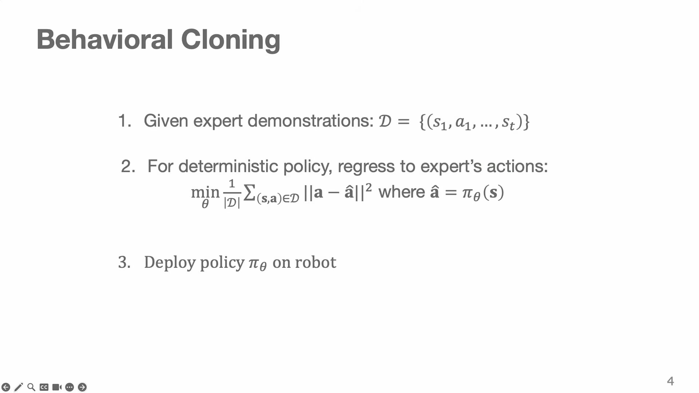
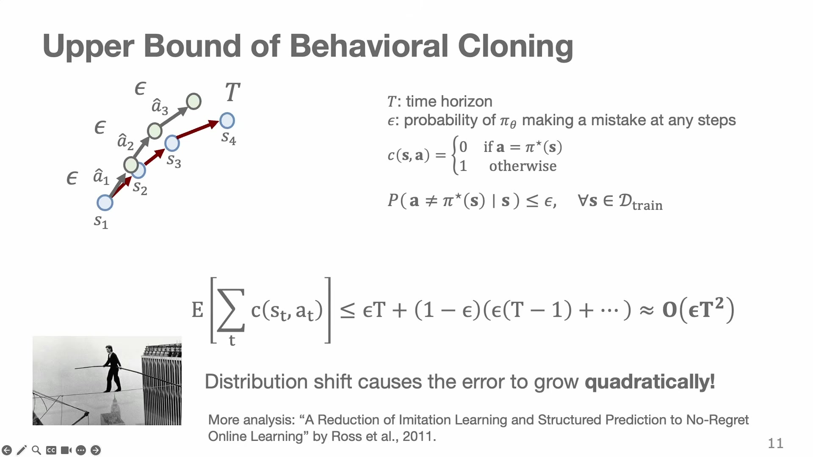
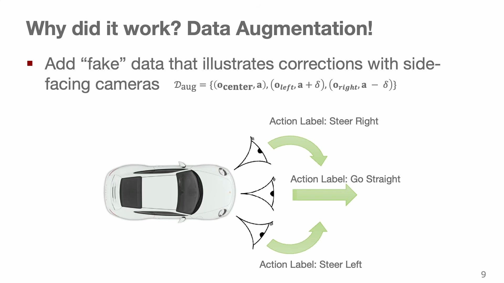
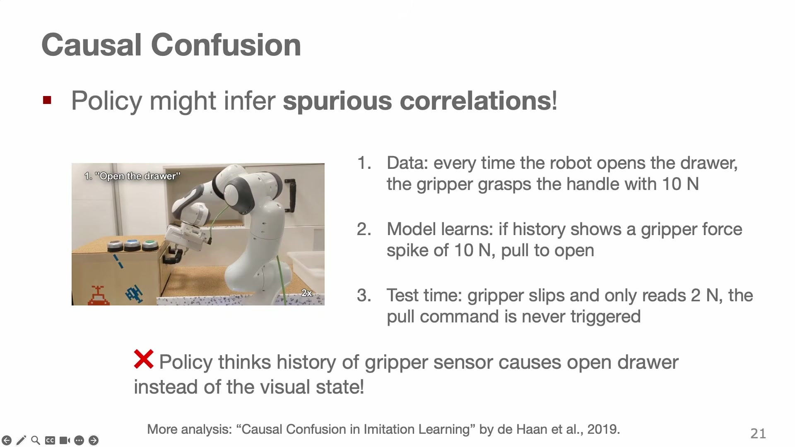
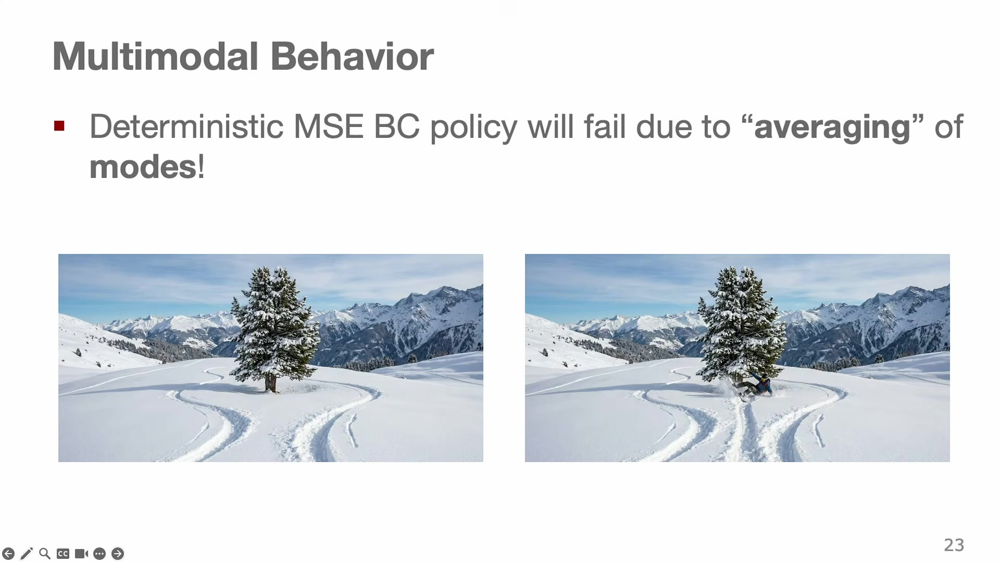
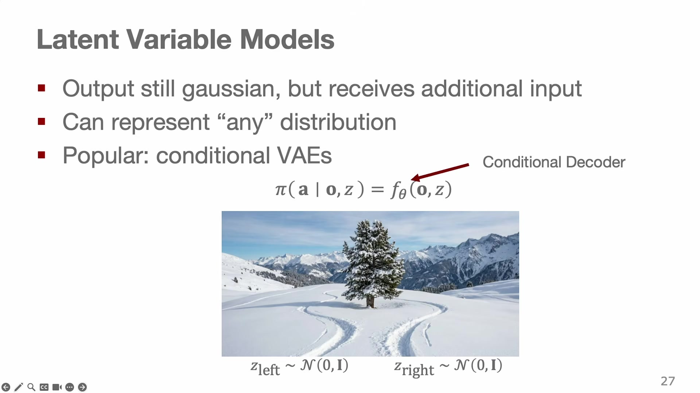

# Imitation Learning

Suppose you already have someone who can do the task. A person sits at a teleoperation rig, drives the robot through the motion twenty times, and you record every camera frame and every command they sent. You now have a dataset of situations and the correct action for each one. Fitting a function to that dataset is the most ordinary thing in machine learning, and it is exactly what imitation learning proposes: treat robot control as supervised learning, with the expert's actions as labels. This chapter is about why that plan is both the foundation of nearly every working robot policy today and, taken naively, guaranteed to fail — and about the three specific reasons it fails, each of which has produced its own body of work.

The three reasons are worth stating up front, because the chapter is organized around them. The robot's own mistakes move it into situations the expert never demonstrated. The expert was not, in fact, deciding from the current observation alone. And there is usually more than one correct action, so a model trained to output *the* correct action will output the average of several correct ones, which is often correct in no sense at all.

## Behavior cloning

The setup first. You are given a dataset of expert **demonstrations**

$$\mathcal{D} = \big\{ (s_1, a_1), (s_2, a_2), \ldots \big\}$$

collected by a human driving a car or teleoperating an arm, and **assumed to be optimal**. That assumption is load-bearing, and we will come back to it. The goal is a policy $\pi_\theta$ that behaves like the expert.

The simplest algorithm that does this is **behavior cloning**, and for a deterministic policy it is regression onto the expert's actions:

$$\min_\theta \; \frac{1}{|\mathcal{D}|} \sum_{(s,a)\,\in\,\mathcal{D}} \big\| a - \hat{a} \big\|^2, \qquad \hat{a} = \pi_\theta(s)$$ {#eq:bc}

**In words.** Adjust the network's weights until the action it predicts for each recorded situation is as close as possible to the action the expert actually took.

**The symbols.** $\mathcal{D}$ is the demonstration dataset and $|\mathcal{D}|$ its size. $s$ is a state or observation from the dataset and $a$ the expert's action in it. $\hat{a} = \pi_\theta(s)$ is the policy's prediction, and $\theta$ are the network weights being optimized. The norm is Euclidean, so this is a mean-squared-error loss.

**Why this shape.** There is no robotics in @eq:bc at all, and that is the point: sample a minibatch, forward pass, compute the squared error, backpropagate, step the optimizer. It is the same loop as training an image classifier, with the same code. This is why behavior cloning is where everyone starts, and why the policies in Chapters 7 and 9 — trained on hundreds of thousands of trajectories — are still, at bottom, doing this. The interesting question is not whether the loss is right. It is whether the *assumptions* that make supervised learning work are still true when the predictions are actions (@fig:bcloss).

{#fig:bcloss width=80%}

## Failure one: the robot walks off the data

Supervised learning rests on an assumption about the data: that examples are **independent and identically distributed**, and in particular that the model's prediction on one input does not affect any other input. Predicting the label of image A does not change image B. That is what licenses the whole apparatus of generalization bounds — low error on a training sample drawn from a distribution implies low error on fresh samples from the same distribution.

Behavior cloning breaks the assumption, and Chapter 2 said how: the action changes the world. Follow the consequence one step at a time. The policy makes a small error and the arm ends up a centimeter to the left of where the expert's trajectory would have put it. That configuration was not in the training set — the expert never made this mistake, so never had to recover from it. The policy's prediction there is therefore untrustworthy, and it is likely to be wrong in a way that moves the robot further off. Errors **compound**. The formal statement is that the two distributions over visited states do not match:

$$p_{\text{expert}}(s) \;\neq\; p_{\pi}(s)$$ {#eq:shift}

**In words.** The situations the robot actually finds itself in are not the situations it was trained on, because it put itself in them.

**The symbols.** $p_{\text{expert}}(s)$ is the distribution of states visited when the expert drives; $p_\pi(s)$ is the distribution visited when the learned policy drives.

**Why this shape.** This is called **distribution shift** or **covariate shift**, and the emphasis belongs on the mechanism rather than the name. Ordinary distribution shift is something that happens *to* a model — the lighting changed, the season changed, the sensor drifted, and all of those affect robots too. This shift is something the model *causes*. Training harder on $\mathcal{D}$ does not fix it, because the problem is not that the model fits $p_{\text{expert}}$ badly; the problem is that it is being evaluated on $p_\pi$ (@fig:shift).

{#fig:shift width=80%}

### How bad is it? The quadratic bound

The cost of compounding error can be quantified, and the result is one of the few genuinely important theorems in this book. Set up a deliberately harsh accounting. Let the horizon be $T$ steps, and charge one unit of cost every time the policy takes an action the expert would not have taken:

$$\ell(s,a) = \begin{cases} 0 & \text{if } a = \pi^*(s) \\ 1 & \text{otherwise} \end{cases}, \qquad P\big(a \neq \pi^*(s) \mid s\big) \le \epsilon \quad \text{for all } s \in \mathcal{D}$$ {#eq:cost}

**In words.** Count mistakes, and suppose the trained policy makes a mistake on at most an $\epsilon$ fraction of the situations it was trained on.

**The symbols.** $\ell$ is the zero-one cost, $\pi^*$ the expert policy, and $\epsilon$ is the policy's per-step error probability — the training error, achieved on states drawn from $\mathcal{D}$ and *only* guaranteed there. Note the scope: the assumption says nothing about states outside the training distribution.

**Why this shape.** The zero-one cost is not how anybody measures robots; it is chosen because it makes the argument clean and because it *understates* the real damage. A real mistake is not one unit of cost, it is a spilled cup or a robot on the floor. If the accounting is bad under a generous cost function, it is worse in reality.

Now propagate. With probability $\epsilon$ the policy errs at the first step, and then it is in a state it has no guarantee about — assume the worst, that it errs at every remaining step, for a cost of $T$. With probability $1-\epsilon$ it survives the first step and faces the same problem with $T-1$ steps to go. Expanding that recursion:

$$\mathbb{E}\Big[\sum_{t} \ell(s_t, a_t)\Big] \;\le\; \epsilon T + (1-\epsilon)\Big(\epsilon (T-1) + \cdots\Big) \;\approx\; O(\epsilon T^2)$$ {#eq:quadratic}

**In words.** Because a single early mistake can spoil every step that follows, the expected number of mistakes grows with the *square* of the episode length, not linearly.

**The symbols.** As above; the sum runs over the steps of an episode.

**Why this shape.** Compare against the supervised-learning answer. If the states really were independent draws, a per-step error rate of $\epsilon$ over $T$ steps would give $O(\epsilon T)$ total mistakes — linear, boring, fine. The extra factor of $T$ comes from the phrase "and then assume it errs at every remaining step": each of the $T$ opportunities to fall off the distribution costs up to $T$, not 1. The image the lecture uses is a **tightrope walker**. As long as you are on the rope, the demonstrations tell you what to do. One step off and no demonstration in the dataset shows you how to get back, because the expert never fell. The error on unseen states is not just large, it is unbounded (@fig:quadratic).

{#fig:quadratic width=80%}

> **Editor's note.** The bound and the analysis behind it are from Ross, Gordon and Bagnell, "A Reduction of Imitation Learning and Structured Prediction to No-Regret Online Learning" (2011), which the lecture cites. The derivation above follows the lecture's sketch rather than the paper's theorem statements.

### Worked example: what the bound means for a real episode

The bound is only useful if you feel it in real units, so put numbers on it. Take a manipulation policy running at 20 Hz on a task that takes 30 seconds. Then

$$T = 20\ \text{Hz} \times 30\ \text{s} = 600\ \text{decisions}.$$

Suppose the policy is good: it takes the expert's action 99.9% of the time on states from the training distribution, so $\epsilon = 0.001$. What do the two bounds predict?

| | Bound | Value |
|---|---|---|
| If states were i.i.d. (supervised) | $\epsilon T$ | $0.001 \times 600 = 0.6$ mistakes |
| Behavior cloning (compounding) | $\epsilon T^2$ | $0.001 \times 600^2 = 360$ mistakes |

Fewer than one mistake per episode against 360 out of 600 steps wrong — with the *same* trained network and the *same* training error. The difference is entirely in whether a mistake is recoverable.

Two honest caveats about the arithmetic, because a bound you cannot interpret is worse than none. First, $\epsilon T^2$ can exceed $T$, at which point it says nothing: total cost cannot exceed one per step. The bound is informative in the regime $\epsilon T \ll 1$, and once $\epsilon T$ approaches 1 the correct reading is not "360 mistakes" but "expect to spend a large fraction of the episode off-distribution." At $\epsilon = 0.001$ and $T = 600$ we have $\epsilon T = 0.6$, so we are right at the edge, which is itself the message: **a 0.1% error rate is not a small error rate for a 30-second task.** Second, this is a worst case; the assumption that leaving the distribution costs you every remaining step is pessimistic, and many real errors are self-correcting.

Now run the numbers the other way, which is the practical use of the result. To get the expected number of compounding mistakes below 1 at $T = 600$, you need $\epsilon < 1/T^2 \approx 3 \times 10^{-6}$. Three mistakes in a million decisions. That is not a training target anyone reaches by collecting more of the same data, which is why the rest of this chapter is about changing the data or the model rather than making $\epsilon$ smaller.

## But it does work sometimes, and the reason is instructive

Against all of this, behavior cloning demonstrably works. In 2016 NVIDIA trained a deep network to map raw pixels from a single forward-facing camera to a steering angle, and drove a car with it on real roads. Nothing in the method addresses distribution shift. Why did it work?

Because of a trick in the data collection that is easy to miss. The car had **three** cameras: one centered, one aimed left, one aimed right. For every frame, the recorded steering command was paired not only with the center image but with the two off-axis images, relabeled:

$$\mathcal{D}_{\text{aug}} = \big\{ (o_{\text{center}},\, a), \; (o_{\text{left}},\, a + \delta), \; (o_{\text{right}},\, a - \delta) \big\}$$ {#eq:threecam}

**In words.** Pretend the car is already drifting left, and label that view with a command that steers back to the right.

**The symbols.** $o_{\text{center}}, o_{\text{left}}, o_{\text{right}}$ are the three simultaneous camera images; $a$ is the human's steering command; $\delta$ is a correction offset applied to compensate for the camera's angular offset.

**Why this shape.** The left camera sees roughly what the center camera would see if the car had drifted to the left, so labeling it with "steer right" manufactures exactly the recovery data the human never generated. **The dataset now covers states off the expert's path, along with the correct action there** — which is a direct, if approximate, attack on @eq:shift. The trick generalizes: the same three-camera scheme was used to teach a quadcopter to follow Swiss forest trails, with the cameras mounted on a walking person's head, producing fly-left, fly-straight and fly-right labels. That case makes the motivation vivid, since collecting genuine demonstrations was not really an option: people cannot fly (@fig:threecam).

{#fig:threecam width=80%}

> **Editor's note.** The lecturer says on the slide that he does not remember the name of the forest-trail paper. It is Giusti et al., "A Machine Learning Approach to Visual Perception of Forest Trails for Mobile Robots" (IEEE Robotics and Automation Letters, 2016). The attribution is background, not lecture content.

The general lesson survives the specific hack, and it is counterintuitive enough to state plainly: **behavior cloning works better when the demonstrations contain mistakes and recoveries.** A dataset of flawless expert trajectories teaches a policy nothing about what to do when things go wrong, which is precisely the situation the policy will create for itself. Perfect data is bad data.

## Fixing the distribution: DAgger and its descendants

The three-camera trick synthesizes off-distribution data. The alternative is to collect it for real, by letting the policy drive and asking the expert what it *should* have done. That is **DAgger**, for dataset aggregation.

\begin{algorithm}[H]
\caption{DAgger (dataset aggregation)}
\KwIn{expert $\pi^*$, initial demonstrations $\mathcal{D}$}
\KwOut{policy $\pi_\theta$}
train $\pi_\theta$ on $\mathcal{D}$ by behavior cloning\;
\While{not converged}{
  roll out $\pi_\theta$ on the robot, recording the visited states $s'_1, \ldots, s'_T$\;
  \For{each visited state $s'$}{
    query the expert for the action it would take, $a^* \sim \pi^*(\cdot \mid s')$\;
  }
  aggregate: $\mathcal{D} \leftarrow \mathcal{D} \cup \{(s', a^*)\}$ \tcp*{keep all old data}
  retrain: $\theta \leftarrow \arg\min_\theta L(\pi_\theta, \mathcal{D})$\;
}
\end{algorithm}

The mechanism is worth being precise about. The states in the aggregated dataset are drawn from $p_\pi$, because the policy generated them, and the labels come from $\pi^*$. As the loop iterates, the policy is trained on the distribution it actually induces, so @eq:shift stops being a mismatch — the two distributions converge. And when they do, the analysis of @eq:quadratic no longer applies: the guarantee on $\epsilon$ now covers the states the policy visits, so mistakes cost $O(\epsilon T)$ rather than $O(\epsilon T^2)$. **DAgger removes the extra factor of $T$.** For the numbers of the worked example, that is the difference between 360 expected mistakes and 0.6.

The costs are practical rather than theoretical. Labeling in hindsight is expensive and slow: someone has to look at each state the robot visited and say what they would have done, without the benefit of being in the moment. It is also not always possible — the human's action space may not match the robot's, so "what would you have done" has no well-defined answer.

**Human-gated DAgger** trims the cost. Let the robot run under supervision and have the human take over *only when it is about to fail*, contributing a partial demonstration $(s'_t, a^*_t, \ldots, s'_T)$ from the point of intervention. The analogy is a driving instructor with a second set of controls, who does not narrate the whole journey but grabs the wheel before the collision. This concentrates the expert's effort exactly where the policy is weak, which is where the informative data is.

That raises a new question, and it is one the field has still not answered well: **how do you know when to intervene?** In the human-gated setting a person is watching, so their judgment is the detector. For an autonomous system, something has to notice that the policy is out of its depth. This is the problem of introspection, and Chapter 11 treats it as one of the field's central open problems, because a model that reliably knows when it does not know would unlock adaptive computation, escalation, and safe deployment all at once.

### Detecting one kind of uncertainty: ambiguous instructions

The lecture offers a case study in which the detector *can* be built, because the uncertainty is of a narrow, identifiable kind: the human's instruction is ambiguous. Told "fetch the round yellow thing" in a scene with several yellow objects, the right behavior is not to guess but to ask.

Making that work needs a model that scores how well a description matches an object. The approach trains a referential-expression **comprehension** model with a **max-margin ranking loss**, so that a correct pairing of object and sentence scores above incorrect pairings by at least a margin:

$$\mathcal{L}_{\text{rank}} = \sum_i \Big[ \lambda_1 \max\big(0,\ m_1 + S(o_i \mid r_j) - S(o_i \mid r_i)\big) + \lambda_2 \max\big(0,\ m_1 + S(o_k \mid r_i) - S(o_i \mid r_i)\big) \Big]$$ {#eq:rank}

**In words.** Push the score of the right object-description pair above the score of a wrong description for that object, and above the score of that description for a wrong object, by a fixed margin.

**The symbols.** $S(o \mid r)$ is the model's score for object $o$ given referring expression $r$. Index $i$ runs over correct pairs; $r_j$ is a mismatched expression and $o_k$ a mismatched object. $m_1$ is the margin, and $\lambda_1, \lambda_2$ weight the two terms. Each $\max(0, \cdot)$ is a hinge: it contributes nothing once the margin is satisfied.

**Why this shape.** Two directions of confusion are penalized, not one, because a scoring model can fail either way — it can prefer the wrong description for an object, or prefer the wrong object for a description. The hinge is what makes the loss stop caring once a pair is ranked correctly by enough of a gap; without it, the model would keep pushing already-correct pairs further apart and spend its capacity on examples it has already learned. And the margin is what makes the *detector* possible: if several candidate objects fall within the margin, the model has by construction failed to separate them, and that is the signal to ask. The system then generates a description for each candidate — "do you mean the banana in the middle?" — and requests a decision.

> **Editor's note.** The full method also trains a generation model with $\mathcal{L}_{\text{gen}} = -\sum_i \log P(r_i \mid v_i)$ and a maximum-mutual-information term. It is Mees and Burgard, "Composing Pick-and-Place Tasks by Grounding Language" (ISER 2020); the dialogue example returns in Chapter 11 as an early instance of adaptation from human feedback.

## Failure two: the expert was not being Markovian

Chapter 2's policy conditions on the current state, $\pi_\theta(a_t \mid o_t)$, on the grounds that the state contains everything relevant. Human experts do not work that way.

A driver tracking a cyclist has been watching that cyclist for five seconds and is acting on where they are going, not where they are. A teleoperator sees the scene with their own eyes, including the part occluded from the robot's camera, and acts on what they know is behind the box. Both are conditioning on something the policy does not have: history in the first case, **privileged information** in the second. The consequence for training is concrete and damaging — the same observation appears twice in the dataset with two different expert actions, and there is nothing in the observation that explains the difference. The model cannot fit both, so it fits neither.

The obvious fix is to give the policy the history. Encode the last $n$ observations with a sequence model — an LSTM, or the transformer of Chapter 7 — and condition on all of it:

$$\pi_\theta(a_t \mid o_1, \ldots, o_t)$$ {#eq:history}

**In words.** Let the policy see the recent past, not just the present.

**The symbols.** $o_1, \ldots, o_t$ is the observation history up to the current step.

**Why this shape.** This is the right idea and it is what modern policies do. But it introduces a failure of its own, and the failure is subtle enough that it took a paper to name it (@fig:causal).

{#fig:causal width=80%}

**Causal confusion** is what happens when a high-capacity model given a rich history finds a shortcut. The lecture's example: in every demonstration of opening a drawer, the gripper's force sensor shows a spike of about 10 newtons at the moment the human starts pulling. The model learns "10-newton spike, therefore pull" — a rule that fits the training data perfectly and inverts the causal direction, since the spike is a *consequence* of pulling, not a reason to pull. At test time the gripper slips, the sensor reads 2 newtons, and the pull never triggers. The policy has learned a correlate of the expert's action instead of the visual situation that caused it.

The uncomfortable part is that more history and more capacity make this *more* likely, not less: a bigger model has more room to find the shortcut. The mitigations are regularization and architectural choices that force attention onto the causally relevant inputs, and this is one of the few places in the book where the honest summary is that the problem is understood better than it is solved.

> **Editor's note.** The reference is de Haan, Jayaraman and Levine, "Causal Confusion in Imitation Learning" (2019), the assigned reading for this week.

## Failure three: there is more than one right answer

The third failure is the one that has reshaped the field's architectures, and unlike the first two it does not require the data to be flawed in any way. It survives perfect demonstrations, perfect observability, and a perfectly Markovian expert.

Consider closing a drawer with a 7-DoF arm. You can push it with the flat of the gripper, hook it from the side, come down from above, or nudge it with the elbow. All four work. The redundancy of Chapter 2 guarantees a family of joint trajectories for any one of them, and human experts are not even consistent with themselves across trials — they do it one way on Monday and another on Tuesday. So the dataset contains, for effectively the same observation, several different actions, all correct.

Now recall what @eq:bc does with that. Mean-squared error is minimized by the conditional *mean* of the targets. If the expert's actions in a given state are bimodal, the mean of the two modes is what the policy will output, and the mean of two good actions is very often a bad one. The lecture's image is a snowboarder approaching a tree: in some demonstrations the expert goes left of the tree, in others right, and the average of left and right is straight into the trunk (@fig:snowboard).

{#fig:snowboard width=76%}

This is why Chapter 1 and Chapter 2 insisted that a policy be a *distribution* over actions. A distribution can say "left or right, either is fine." A point estimate cannot. The rest of this section is the toolkit for representing such a distribution — four options, in increasing order of expressiveness and cost, and all four reappear later in the book.

### Mixture of Gaussians

Predict several Gaussians and a weight for each:

$$\pi(a \mid o) = \sum_i w_i \, \mathcal{N}(\mu_i, \Sigma_i)$$ {#eq:mog}

**In words.** Represent the possible actions as a handful of bumps, each with its own center, spread and importance.

**The symbols.** $\mu_i$ and $\Sigma_i$ are the mean and covariance of the $i$-th component and $w_i$ its mixing weight, with the weights summing to one; the network outputs all three sets of quantities as a function of the observation.

**Why this shape.** A single Gaussian is unimodal and therefore has exactly the averaging problem we are trying to escape; a mixture of them is the smallest change that fixes it. The limitation is that **you must decide the number of modes in advance.** For a drawer with four sensible strategies that is fine. For a dexterous hand whose action distribution might have thousands of modes, choosing the number is hopeless, and a mixture with too few components goes back to averaging within each one.

### Autoregressive discretization

Chop the action space into bins and turn regression into classification. A classifier over bins can represent any shape of distribution, including several separated peaks, because there is no assumption of unimodality to violate. The catch is dimensionality: binning a 7-dimensional action into 256 bins per dimension jointly gives $256^7$ classes, which is not a classifier, it is a fantasy.

The catch is dimensionality, and it is worth writing the number down. Take the binning Chapter 7 develops in full — 256 bins per dimension — applied jointly to a 7-dimensional action:

$$256^7 = 2^{56} \approx 7.2 \times 10^{16}$$

joint classes. There is no dataset, and no softmax layer, that makes sense of that.

The fix is to discretize **per dimension** and predict the dimensions one at a time, using the chain rule of probability:

$$p(a_t \mid s_t) = p(a_{t,0} \mid s_t)\; p(a_{t,1} \mid s_t, a_{t,0})\; p(a_{t,2} \mid s_t, a_{t,0}, a_{t,1}) \cdots$$ {#eq:autoreg}

**In words.** Predict the first component of the action, then the second given the first, then the third given both, and so on.

**The symbols.** $a_{t,j}$ is the $j$-th component of the action at time $t$; each factor is a categorical distribution over that component's bins.

**Why this shape.** The chain rule is exact — no approximation is being made — and it converts an exponential problem into a linear one: $n$ dimensions cost $n$ categorical predictions of 256 classes each rather than one prediction of $256^n$. Conditioning each component on the earlier ones is what preserves the ability to represent correlated modes; predict the dimensions independently and you get back the product of marginals, which would allow the policy to combine the $x$ of "go left" with the $y$ of "go right". The natural implementation is a sequence model, and **this is how the first vision-language-action models worked** — which is also the drawback, since it commits you to an autoregressive transformer backbone and to paying for one forward pass per action dimension. Chapter 7 takes up both the mechanics of action tokenization and the reason this scheme breaks down at high control frequencies.

### Diffusion

The third option models a continuous distribution directly by learning to reverse a noising process. Chapter 6 develops it properly; the preview the lecture gives is enough to place it here:

$$\text{forward: } x_{k+1} = x_k + \text{noise}, \qquad \text{backward: learn } f(x_k) = x_{k-1}$$ {#eq:diffprev}

**In words.** Gradually destroy a sample with noise, and train a network to undo one step of the destruction; then start from pure noise and undo it repeatedly.

**The symbols.** $x_k$ is the partially noised sample at denoising step $k$, with $k=0$ the clean sample. In practice the network predicts the *noise* that was added rather than the previous sample, and one denoising step is $x_{k-1} \approx x_k - f(x_k)$.

**Why this shape.** Predicting the noise rather than the clean sample turns an intractable inversion into an ordinary regression with a Gaussian target, which is the trick that made diffusion practical; Chapter 6 derives it. For imitation learning the relevant fact is that the object being denoised does not have to be an image — replace the image with a **robot action sequence** and you have a policy that samples from a genuinely multimodal continuous distribution with no fixed number of modes and no per-dimension factorization. Note that this option and the previous one are both *iterative*, but along different axes: autoregressive discretization iterates over action dimensions, diffusion iterates over denoising steps (@fig:diffprev).

{#fig:diffprev width=76%}

### Latent-variable models

The fourth option keeps a simple output distribution and adds an extra input that selects which behavior to produce:

$$\pi(a \mid o, z) = f_\theta(o, z), \qquad z \sim \mathcal{N}(0, \mathbf{I})$$ {#eq:latent}

**In words.** Draw a random seed, and let the policy's output depend on it as well as on the observation, so that different seeds give different valid behaviors.

**The symbols.** $z$ is a **latent variable** sampled from a prior — a standard Gaussian — and $f_\theta$ is the network mapping observation and latent to an action distribution.

**Why this shape.** The output can stay Gaussian and unimodal *given* $z$, while the marginal over $z$ is arbitrarily complex, so the machinery stays simple and the expressiveness comes from the extra input. The essential caveat is that $z$ has to be *trained* to correspond to modes; you cannot bolt a random number onto a trained policy and expect it to select behaviors, because nothing has taught the network what the number means. That training is what the conditional variational autoencoder of the next section does.

There is a distinction here worth keeping, because it is easy to blur. **Task conditioning** is a supervised signal that says *which* behavior is wanted — a task identifier, a goal image, a language instruction. **A latent** captures the *style* or *mode within* that behavior. Even with the task fully specified, there remain infinitely many ways to execute it, and that residual variation is what $z$ absorbs (@fig:latent).

### The four tools side by side

The four options solve the same problem and fail differently, and it is worth having the comparison in one place before the rest of the book puts each of them to work.

| Tool | How it represents modes | What it costs | Where it fails | Developed in |
|---|---|---|---|---|
| Mixture of Gaussians | a fixed number of explicit components | one forward pass | you must fix the number of modes in advance | — |
| Autoregressive discretization | a categorical distribution per action dimension | one pass per dimension; needs a sequence-model backbone | degrades at high control frequency | Ch. 7 |
| Diffusion | learned reversal of a noising process, no fixed mode count | many denoising steps per action | slow enough to threaten real-time control | Ch. 6 |
| Latent-variable model | a sampled seed selects the behavior | one pass, plus training the latent to mean something | the decoder can ignore the latent; unseen latents give untrusted actions | Ch. 6 |

Read the last column as a preview of the book's arc. Each of the three surviving tools is developed later, and in each case the development is mostly a matter of paying down the cost in the third column.

{#fig:latent width=76%}

## Scaling to any task: goal-conditioning

So far the policy has one job. To learn many, something has to tell it which one. The lecture traces three generations of an answer:

$$\underbrace{\pi_\theta(a_t \mid s_t)}_{\text{one task}} \;\longrightarrow\; \underbrace{\pi_\theta(a_t \mid s_t, \text{task id})}_{\text{task-conditioned}} \;\longrightarrow\; \underbrace{\pi_\theta(a_t \mid s_t, s_g)}_{\text{goal-conditioned}}$$ {#eq:conditioning}

**In words.** First a policy per task; then one policy told which of a fixed list of tasks to do; then one policy told which situation to bring about.

**The symbols.** The task identifier is a discrete label from a predefined set. $s_g$ is a **goal state** — a target situation, supplied as an image of the desired outcome or as a language instruction describing it.

**Why this shape.** The move from a discrete identifier to a goal state is the interesting one, and the argument for it is that **task success is not well defined.** If the task is "close the drawer" and the drawer ends up half closed, did it succeed? At what threshold — 90%, 95%? Any answer is arbitrary, because "closing a drawer" is not a discrete event but a continuous change of state, and real activities decompose into sub-activities that shade into each other. Rather than fight this, goal-conditioning changes the question from "did you do task 7?" to "did you reach this state?", which is answerable. And since states are continuous, so is the space of goals: one policy can be asked for any goal in it, including combinations nobody enumerated in advance. The cost is that you now need a way to specify goals that a person is willing to use, which is why goal *images* give way to language, and why Chapters 7 and 9 spend so much effort on making language the interface.

## Case study: learning from play

Goal-conditioning changes what data you need, and the change is liberating. If the policy is trained to reach arbitrary goals, then any trajectory is a demonstration — of reaching wherever it happened to end up. This makes an unusual kind of dataset viable.

**Play data** is unstructured teleoperation with no task assigned in advance. A person picks up the controls and messes about with the scene, satisfying their curiosity, the way a child plays with toys. It is cheap to collect, it needs no **resets** between episodes (there is no episode), and it is richly multimodal by construction, since the operator is doing whatever occurs to them.

Turning play into a policy needs two ideas. The first is **goal relabeling**: sample a random window from the play log, take its last frame as the goal, and you have a demonstration of reaching that goal from the window's first state. Nothing was labeled by anyone. The second is a model that can handle the enormous multimodality of the result, and here the latent-variable option from above is developed in full, as a sequence-to-sequence conditional variational autoencoder with three parts (@fig:play):

- **A posterior, or plan recognition model, $q_\phi(z \mid \tau)$.** It sees the entire sampled window — including how it turned out — and infers which behavior was executed. It exists only during training.
- **A prior, or plan proposal model, $p_\theta(z \mid c)$.** It sees only the initial state and the goal, and outputs a distribution over behaviors that could connect them.
- **An action decoder, $p_\theta(\tau \mid z, c)$.** Given a latent plan and the goal, it produces the actions.

{#fig:play width=85%}

Training minimizes the divergence between prior and posterior, so that the prior comes to place its mass on behaviors that actually occur in the data. At test time the posterior is **discarded** — there is no future to look at — and plans are sampled from the prior. The division of labor is the elegant part: because the decoder is told which plan it is executing, it no longer has to represent the ambiguity itself, and its capacity is freed to model a single behavior well. Language and image goals become interchangeable by embedding both into the same goal space, which is what allows most of the control to be learned from unlabeled visual play with only a small amount of language annotation.

The objective is the standard variational lower bound. We want to maximize the likelihood of the demonstrated data, but $z$ is continuous, so marginalizing it is intractable; instead maximize a bound:

$$\log p_\theta(\tau) \;\ge\; \underbrace{-\,D_{\mathrm{KL}}\big(q_\phi(z\mid\tau)\,\|\,p_\theta(z)\big)}_{\text{is the inferred plan a plausible one?}} \;+\; \underbrace{\mathbb{E}_{q_\phi(z\mid\tau)}\big[\log p_\theta(\tau \mid z)\big]}_{\text{does the plan explain what happened?}}$$ {#eq:elbo}

and with the goal and initial state collected into a context $c = (s_c, s_g)$:

$$\log p_\theta(\tau \mid c) \;\ge\; -\,D_{\mathrm{KL}}\big(q_\phi(z\mid\tau, c)\,\|\,p_\theta(z \mid c)\big) \;+\; \mathbb{E}_{q_\phi(z\mid\tau, c)}\big[\log p_\theta(\tau \mid z, c)\big]$$ {#eq:elboc}

**In words.** Explain the demonstrated trajectory as well as possible using a plan that the proposal model could plausibly have suggested.

**The symbols.** $\tau$ is the sampled window of play. $q_\phi$ is the posterior with parameters $\phi$, $p_\theta$ the prior and decoder with parameters $\theta$, and $D_{\mathrm{KL}}$ the Kullback–Leibler divergence, which measures how far one distribution is from another. $c$ is the context: the initial state $s_c$ and the goal $s_g$.

**Why this shape.** The two terms pull against each other and both are necessary. The reconstruction term alone would let the posterior use $z$ as a private channel — encoding the whole trajectory into it — after which the prior, which never sees the trajectory, could not reproduce anything useful. The divergence term prevents that by requiring the posterior's plans to be ones the prior would also propose. Conversely the divergence term alone is minimized by ignoring $z$ entirely. This is the same bound that Chapter 6 derives for variational autoencoders and extends to diffusion; @eq:elbo is its first appearance in this book, and it is worth noticing that it arrived here from a robotics problem rather than an image-generation one (@fig:elbo).

{#fig:elbo width=80%}

> **Editor's note.** The play-data method is Lynch et al., "Learning Latent Plans from Play" (2019), and the lecture presents it alongside the lecturer's own line of work that builds on it: the **CALVIN** benchmark for long-horizon language-conditioned manipulation (Mees et al., 2022), the HULC policy trained on it, and later work learning affordances from unstructured data. CALVIN reappears in Chapter 11, where the lecturer describes it as a by-product of building his own simulator that became one of his most-cited papers.

## The chapter in one table

The lecture closes by mapping each failure to its fixes, and the map is the most useful single summary of imitation learning as it stands.

| Failure | Why it happens | Fixes |
|---|---|---|
| **Distribution shift** | the policy's own errors move it to states no demonstration covers | augmented data with synthetic recoveries; DAgger; human-gated DAgger; detecting when to ask for help |
| **Non-Markovian expert** | the human acted on history and on privileged information the robot lacks | condition on a history of observations, or on privileged inputs — while guarding against causal confusion |
| **Multimodal behavior** | several actions are correct and squared error returns their mean | mixture of Gaussians; autoregressive discretization; diffusion; latent-variable models |

Notice that the first row is about the *data*, the second about the *inputs*, and the third about the *output distribution*. They are independent problems with independent fixes, and a policy can suffer all three at once — which, in practice, most do.

## Where this breaks

The three failures of this chapter have fixes, and every fix has a cost.

**The expert-optimality assumption is doing more work than it admits.** Everything here assumed the demonstrations are optimal. They are not: teleoperators are slow, inconsistent, and constrained by an interface that does not match the robot's capabilities. Behavior cloning faithfully reproduces all of it. This is the ceiling that Chapter 4 opens by attacking — a policy trained by imitation cannot be better than what it was shown, and Chapter 11 makes the point sharpest with a three-state example: if your data contains a path from state 1 to 2 and from 2 to 3, no amount of imitation will discover that going straight from 1 to 3 is better, because nobody demonstrated it.

**DAgger needs an expert on call, which real deployments do not have.** The theoretical fix to distribution shift requires querying $\pi^*$ at states the policy visits, which means a human available for the duration of training, labeling in hindsight. Human-gated variants reduce the burden without removing it. Nothing in this chapter produces a policy that improves on its own.

**Multimodality is handled, not solved.** Each of the four tools buys expressiveness with something. Mixtures need the number of modes in advance. Autoregressive discretization costs a forward pass per dimension and degrades at high frequency. Diffusion costs many denoising steps per action, which Chapter 6 shows is a real-time problem. Latent-variable models require the latent to be trained into meaning, and Chapter 6 also lists their failure modes — a decoder powerful enough to ignore the latent will, and a latent sampled between two trained modes lands somewhere the decoder has never been, which for a robot means an action nobody has any reason to trust.

**Causal confusion has no reliable fix.** Adding history is necessary and makes shortcut-learning more likely. The mitigations are regularization and careful architecture, which are ways of managing the problem, not eliminating it.

**Knowing when to ask for help remains open.** The intervention-detection problem was raised in this chapter and answered only for the narrow case of ambiguous language, where the margin in @eq:rank furnishes a natural signal. The general version — a policy that knows it is out of distribution — is unsolved, and Chapter 11 argues that it is one of the hardest things blocking deployment, because large models are good at pattern completion and poorly calibrated about their own competence.

## What this connects to

This chapter is where the abstract objective of Chapter 2 first meets data, and where each of the book's later machinery earns its motivation.

**Backwards.** @eq:bc is a way of pursuing @eq:objective without ever writing down a reward: assume the expert was maximizing it, and copy the expert. The compounding-error argument of @eq:quadratic is the quantitative form of Chapter 2's observation that actions change the world, and the state-versus-observation distinction returns here as the privileged-information problem.

**Forwards, and specifically.** Chapters 4 and 5 exist because of the expert-optimality ceiling: reinforcement learning gives up the expert in exchange for the ability to exceed it. Chapter 6 is the full development of two of this chapter's four multimodality tools — the variational autoencoder that @eq:elbo previews, and the diffusion model that @eq:diffprev sketches — and closes with the flow-matching methods that have largely replaced both. Chapter 7 develops the third tool, autoregressive discretization, into action tokenization, and supplies the sequence models that @eq:history needs; it also solves the smoothness problem this chapter did not raise, by predicting chunks of actions rather than single steps. Chapter 9 is this chapter at scale: the generalist policies trained on hundreds of thousands of trajectories are goal-conditioned behavior cloning in the sense of @eq:conditioning, and the specific formulation they use — $\pi_\theta(a_t \mid s_t, s_g)$ with goals supplied as images or language — is the one derived here.

Two threads to watch. The **play-data idea** returns in Chapter 8 as an argument for world models, which can consume any interaction data including failures, and in Chapter 11 as the data-flywheel problem of learning from a robot's own suboptimal experience. And the **goal-conditioned formulation** turns out to be what makes cross-embodiment learning possible at all: if the interface is "reach this state" rather than "do task 7 from my list", the same interface works for a robot arm, a quadruped and a drone.

## Further reading

- **P. de Haan, D. Jayaraman and S. Levine, "Causal Confusion in Imitation Learning" (2019).** The paper behind this chapter's second failure mode. Read it for the diagnosis — that imitation learners latch onto correlates of the expert's action rather than its causes, and that more information can make this worse — and for the graph-based framing of which inputs a policy should be allowed to use.
- **S. Pari, N. Muhammad, S. Arunachalam and L. Pinto, "The Surprising Effectiveness of Representation Learning for Visual Imitation" (2021).** A useful counterweight to the architectural sophistication of this chapter's second half. It argues that a good visual representation plus nearest-neighbor retrieval competes with learned policies, which is worth taking seriously before assuming the model is where the difficulty lies.
- **A. Zeng, P. Florence, J. Tompson et al., "Transporter Networks: Rearranging the Visual World for Robotic Manipulation" (2020).** A different attack on the same problems: build the spatial structure of manipulation into the architecture so that far less data is needed. It is the clearest available demonstration that the right inductive bias can substitute for demonstrations, and it prefigures the spatial-discretization idea that Chapter 4 uses to bring deep Q-learning to a real arm.
