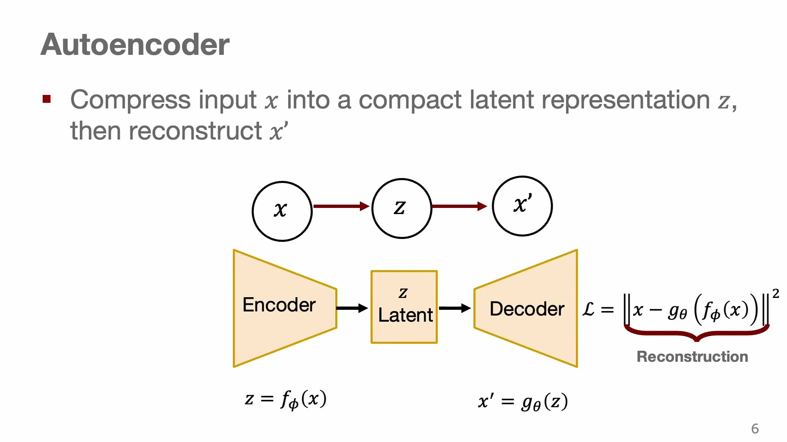
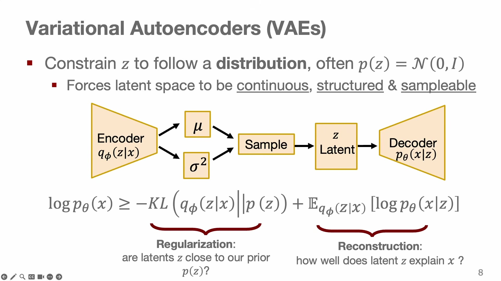
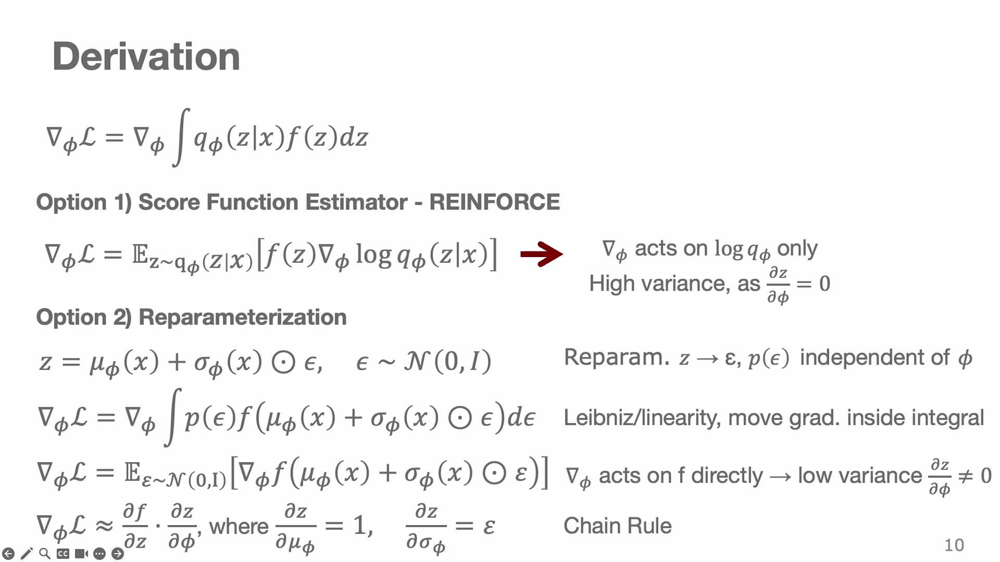
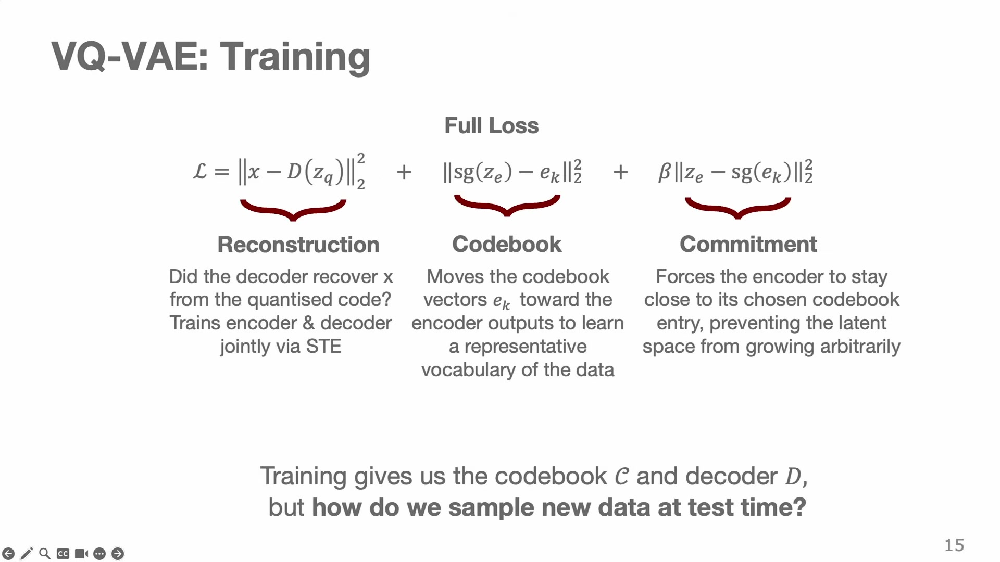
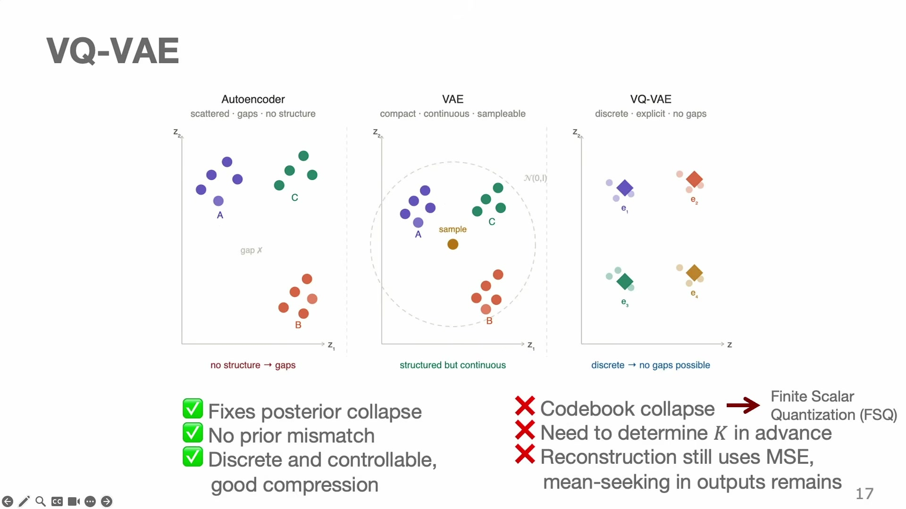
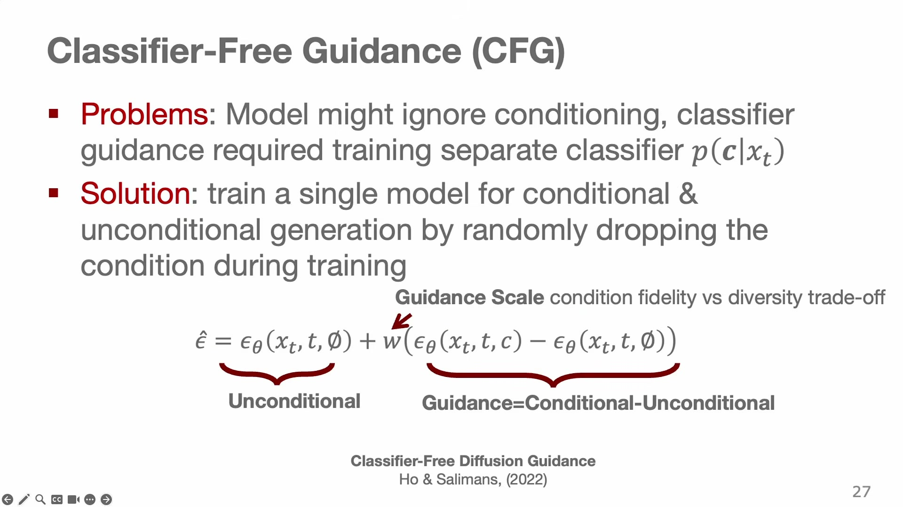
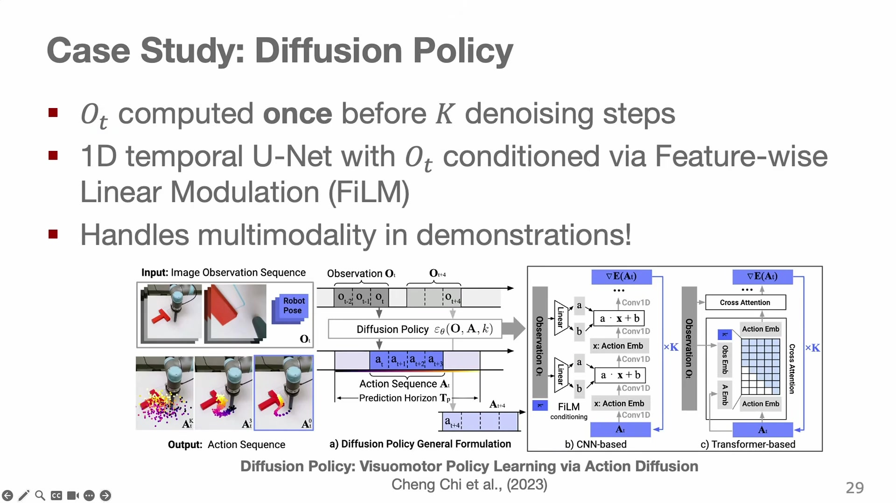
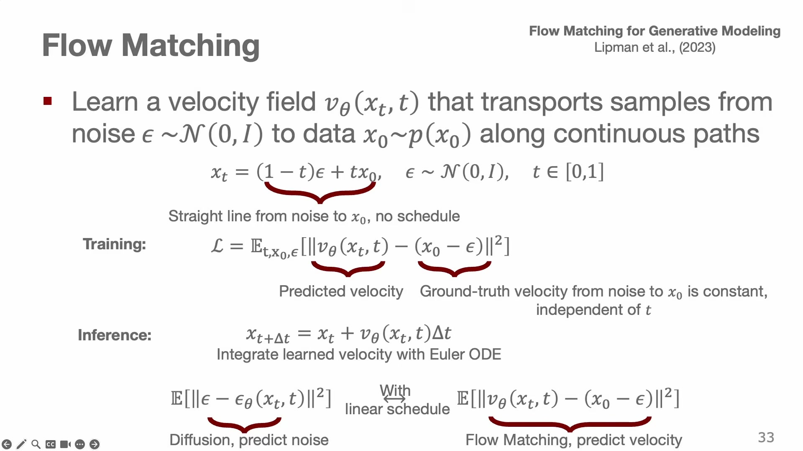
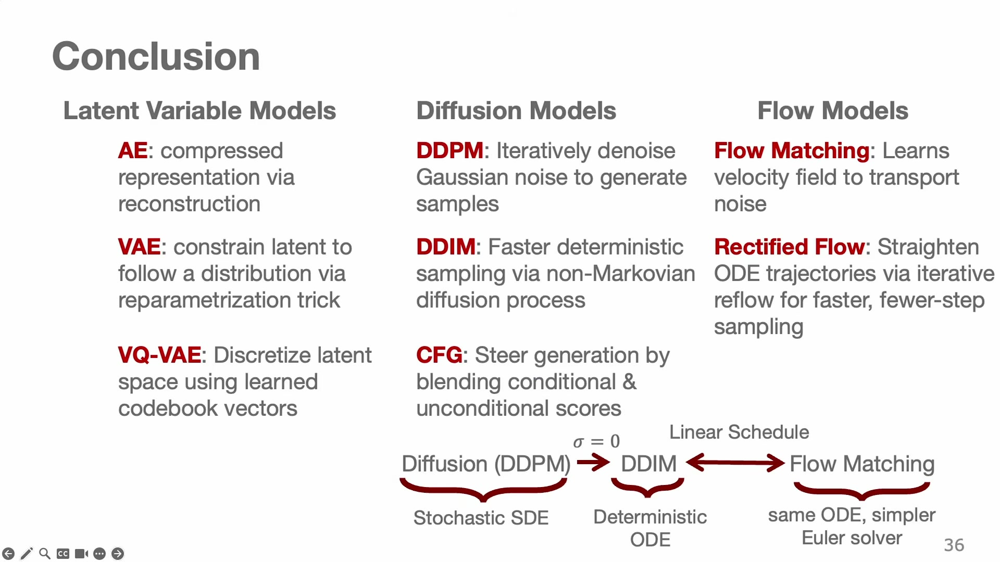

# Generative Models

Chapter 3 identified a failure that no amount of data fixes: when several actions are equally correct, a policy trained to output *the* correct action outputs their average, and the average of "go left of the tree" and "go right of the tree" is a collision. The conclusion was that a policy has to be a distribution over actions, and the chapter listed four ways to build one. This chapter builds two of them properly, and then a third that has largely replaced both.

The framing that unifies everything here is worth stating before any mathematics.

> A generative model is a learned transformation from a simple distribution $p(z)$ — usually a Gaussian you can sample from trivially — into a complicated data distribution $p_{\text{data}}(x)$.

Every model in this chapter is an instance of that sentence, differing only in the shape of the transformation and how it is trained. And every one of them applies to robotics by the same substitution: replace $p_\theta(x)$, the distribution over images, with $\pi_\theta(a_t \mid s_t)$, the distribution over actions. The reason image-generation research matters to robot control is that the object being generated is arbitrary.

## Autoencoders, and why they cannot generate

Start with the structure that almost works. An **autoencoder** is two networks trained together: an encoder that compresses an input to a low-dimensional code, and a decoder that reconstructs the input from the code.

$$z = f_\phi(x), \qquad x' = g_\theta(z), \qquad \mathcal{L} = \big\| x - g_\theta\big(f_\phi(x)\big) \big\|^2$$ {#eq:ae}

**In words.** Squeeze the input through a narrow channel and require that it can be rebuilt on the other side.

**The symbols.** $x$ is the input, $z$ the **latent code**, $f_\phi$ the encoder with parameters $\phi$ and $g_\theta$ the decoder with parameters $\theta$. The loss is reconstruction error.

**Why this shape.** Training needs no labels — the input is its own target — and the bottleneck is what does the work: if $z$ is much smaller than $x$, the network cannot memorize and must find structure. The problem is what @eq:ae leaves undetermined. Nothing constrains *where* in the latent space the encoder puts things, so the codes end up scattered with gaps between them, the only regularizer is the bottleneck's width, and — the fatal defect — $z$ is a deterministic function of an input you must already possess. **To get a code you need a real $x$, so you cannot sample new data.** An autoencoder compresses; it does not generate (@fig:ae).

{#fig:ae width=76%}

## The variational autoencoder

The repair is to encode to a *distribution* rather than a point, and to insist that the distribution stay near a prior you can sample from. The encoder outputs a mean and a standard deviation; a latent is drawn from that Gaussian; and a divergence term pulls it toward $p(z) = \mathcal{N}(0,\mathbf{I})$.

Maximizing the likelihood of the data directly is intractable, because it would require integrating over all latents. Instead maximize a lower bound on it, the **evidence lower bound**:

$$\log p_\theta(x) \;\ge\; \underbrace{-\,D_{\mathrm{KL}}\big(q_\phi(z\mid x)\,\|\,p(z)\big)}_{\text{regularization}} \;+\; \underbrace{\mathbb{E}_{q_\phi(z\mid x)}\big[\log p_\theta(x\mid z)\big]}_{\text{reconstruction}}$$ {#eq:vaeelbo}

**In words.** Reconstruct the input as well as possible using a latent code that could plausibly have come from the prior.

**The symbols.** $q_\phi(z\mid x)$ is the encoder, now a distribution — the **posterior**. $p_\theta(x \mid z)$ is the decoder. $p(z)$ is the fixed prior. $D_{\mathrm{KL}}$ is the Kullback–Leibler divergence.

**Why this shape.** Chapter 3 met this bound already, in the play-data model, and the reason for the two terms is the same here. Reconstruction alone would let the encoder scatter codes anywhere it likes, which is the autoencoder's problem again. Divergence alone is minimized by ignoring the input entirely. Together they force the latent space to be both *informative* and *shaped like the prior* — and that second property is what makes generation possible: at test time you throw the encoder away, draw $z \sim \mathcal{N}(0,\mathbf{I})$, and decode. There is no input required, so there is nothing to compress; the model produces data (@fig:vae).

{#fig:vae width=78%}

### The reparameterization trick, and what it saves

@eq:vaeelbo has a gradient problem. The expectation is taken over $q_\phi$, whose parameters we need gradients for, and sampling is not a differentiable operation. Chapter 5 used the fix already; here is why it is the right one.

Two estimators are available. The first treats the sample as an opaque event and differentiates the log-probability of having drawn it — the **score-function estimator**, which is REINFORCE from Chapter 5 applied to a latent variable instead of an action:

$$\nabla_\phi L = \mathbb{E}_{q_\phi}\big[\, f(z)\, \nabla_\phi \log q_\phi(z \mid x) \,\big]$$

The second moves the randomness outside the parameters — the **reparameterization trick**:

$$z = \mu_\phi(x) + \sigma_\phi(x)\odot\epsilon, \qquad \epsilon\sim\mathcal{N}(0,\mathbf{I}), \qquad \nabla_\phi L = \mathbb{E}_{\epsilon}\big[\, \nabla_\phi f\big(\mu_\phi(x) + \sigma_\phi(x)\odot\epsilon\big) \,\big]$$ {#eq:reparam6}

**In words.** Rather than sampling from a distribution whose shape you are trying to learn, sample a fixed standard noise and stretch and shift it with the quantities you are learning.

**The symbols.** $\mu_\phi(x)$ and $\sigma_\phi(x)$ are the encoder's outputs; $\epsilon$ is noise from a distribution with no learnable parameters; $\odot$ is elementwise multiplication; $f$ is whatever the latent feeds into.

**Why this shape.** The difference between the two estimators is where the gradient lands, and it is the difference between working and not working. In the score-function version the gradient acts only on $\log q_\phi$ — the optimizer learns *that* a sample was good but nothing about *which direction* to move $\mu$ and $\sigma$ to get more like it, so it must infer the direction statistically from many samples. Variance is high. In the reparameterized version the gradient passes through $f$ itself, so the decoder's own gradient tells the encoder which way to shift the latent. The signal is a direction rather than a scalar reward, and the variance is dramatically lower. This is worth carrying as a general principle: **when you can push the randomness out of the parameters, do, because it converts a reinforcement-learning-style estimate into a supervised one** (@fig:reparam).

{#fig:reparam width=80%}

### Where VAEs fail

Two failure modes, and the second is specifically dangerous for robots.

**Posterior collapse.** If the decoder is powerful enough to model $p(x)$ on its own, the cheapest way to satisfy @eq:vaeelbo is to ignore $z$ entirely: the divergence term goes to zero when the posterior equals the prior, and the reconstruction term is paid for by the decoder's own capacity. The latent becomes uninformative, the model becomes deterministic, and we are back to the problem the chapter opened with.

**Prior mismatch.** The prior is a smooth Gaussian; the posterior, in practice, is a set of clusters with gaps between them. Sample a $z$ from the prior that falls in a gap — between two modes the encoder actually used — and you have handed the decoder a code it was never trained on. For an image model the result is a blurry hallucination. For a policy, **the output is an action**, and an action decoded from a latent no training example ever occupied is one with no reason to be safe. This is the same pathology as Chapter 5's actor exploiting a critic's extrapolation, and it is the reason latent-variable policies are used with care.

## VQ-VAE: making the latent discrete

One response to the continuous latent's problems is to eliminate the continuum. A **vector-quantized VAE** replaces the Gaussian latent with a finite **codebook** and forces the encoder to commit to one entry:

$$z_q(x) = e_{k^*}, \qquad k^* = \arg\min_j \big\| z_e(x) - e_j \big\|_2$$ {#eq:vq}

**In words.** Encode the input, then snap the result to whichever of a fixed set of learned vectors is nearest.

**The symbols.** $z_e(x)$ is the encoder's raw continuous output, $C = \{e_1,\ldots,e_K\}$ the codebook of $K$ learned vectors, and $z_q$ the quantized latent handed to the decoder.

**Why this shape.** Snapping to a codebook means the decoder only ever sees codes that exist, which removes prior mismatch by construction — there are no gaps, because there is no continuum. It also converts the latent into a **sequence of integers**, which is what makes the second half of this chapter and all of Chapter 7 possible: an integer sequence is exactly what a language model consumes.

The obstacle is that $\arg\min$ has no useful gradient — it is piecewise constant, so its derivative is zero almost everywhere, and no learning signal reaches the encoder. The fix is the **straight-through estimator**:

$$z_q = z_e + \mathrm{sg}\big[z_q - z_e\big]$$ {#eq:ste}

**In words.** In the forward pass use the quantized code; in the backward pass pretend the quantization never happened and pass the decoder's gradient straight to the encoder.

**The symbols.** $\mathrm{sg}[\cdot]$ is the stop-gradient operator: the identity in the forward pass, zero in the backward pass.

**Why this shape.** Read @eq:ste in both directions. Forward, the stop-gradient is transparent, so $z_q = z_e + (z_q - z_e) = z_q$, exactly the quantized code. Backward, the bracketed term contributes nothing, so the gradient with respect to $z_e$ is the gradient with respect to $z_q$ — the quantization step is invisible. It is a deliberate lie about the derivative, justified only by working, and it is one of the more common tricks in modern generative modelling.

The full objective needs two more terms, because the codebook has to be learned as well:

$$\mathcal{L} = \underbrace{\big\|x - D(z_q)\big\|_2}_{\text{reconstruction}} \;+\; \underbrace{\big\|\mathrm{sg}(z_e) - e_{k^*}\big\|_2^2}_{\text{codebook}} \;+\; \underbrace{\beta\big\|z_e - \mathrm{sg}(e_{k^*})\big\|_2^2}_{\text{commitment}}$$ {#eq:vqloss}

**In words.** Reconstruct the input; move the chosen codebook vector toward the encoder's output; and move the encoder's output toward the codebook vector it chose.

**The symbols.** $D$ is the decoder, $e_{k^*}$ the selected code, and $\beta$ the weight on the commitment term.

**Why this shape.** The stop-gradients allocate responsibility. In the codebook term, $z_e$ is frozen, so the gradient moves only $e_{k^*}$ — the code drifts toward the data assigned to it, which is one step of $k$-means. In the commitment term, $e_{k^*}$ is frozen, so the gradient moves only the encoder — the encoder is discouraged from drifting away from the codebook it must quantize to. Without the commitment term the encoder's outputs can grow without bound while the codebook chases them and never catches up. Two terms with the same-looking norm do opposite jobs, and the stop-gradient is what distinguishes them (@fig:vq).

{#fig:vq width=80%}

**Generation is now a two-stage affair,** and this is the structural consequence that matters most. The VQ-VAE itself is not a generative model: it has no prior you can sample from. So after training, encode the dataset into sequences of code indices and fit a **categorical autoregressive prior** over those sequences,

$$p(k_1,\ldots,k_n) = \prod_{i} p(k_i \mid k_1, \ldots, k_{i-1}),$$

with a sequence model — in practice a transformer. To generate, sample indices from the prior, look up their vectors, and decode. The generative modelling has been outsourced to next-token prediction, which is why VQ-VAE is the bridge between this chapter and the next.

The limitations are worth knowing because they recur. **Codebook collapse** — only a handful of the $K$ codes ever get used, wasting capacity — is common enough that alternatives such as finite scalar quantization exist to avoid it. $K$ must be fixed in advance. And the reconstruction loss is still a squared error, so reconstructions remain mean-seeking and slightly blurry.

In robotics, this machinery is everywhere, and it is worth naming the specific uses because they are the plumbing of the book's second half. **Tokenizing images and video** so that a sequence model can consume them — the approach behind driving and simulation models such as GAIA and NVIDIA's Cosmos, which Chapter 8 uses as a video backbone. **Learning latent actions from unlabeled video**, as in LAPA and Genie, where the codebook comes to represent "what changed between these frames" without any action labels. **Discretizing continuous robot actions** into tokens a vision-language model can emit, which is Chapter 7's subject. And the **latent plans** of Chapter 3's play-data model, where the code selects which behavior to execute.

Putting the three latent structures side by side makes the progression legible: an autoencoder's latent space is unconstrained and full of gaps; a VAE's is pulled toward a smooth prior but still has gaps between the clusters it actually uses; a VQ-VAE's consists of nothing but the points it uses, at the cost of no longer being continuous (@fig:latents).

{#fig:latents width=82%}

## Diffusion

The third approach abandons the bottleneck entirely. Rather than compressing to a latent and decoding, model the full continuous distribution over $x$ by learning to reverse a process that destroys it.

The **forward process** adds noise in small steps according to a schedule:

$$x_{k+1} = \underbrace{\sqrt{1-\beta_{k+1}}\; x_k}_{\text{signal, shrunk}} \;+\; \underbrace{\sqrt{\beta_{k+1}}\;\epsilon_k}_{\text{noise, added}}, \qquad \epsilon_k \sim \mathcal{N}(0,\mathbf{I})$$ {#eq:forward}

**In words.** At each step, shrink what is left of the data slightly and mix in a little fresh noise, until nothing but noise remains.

**The symbols.** $x_0$ is the clean data and $x_K$ is (almost) pure noise; $k$ indexes the **denoising step**, running from 0 at the data end to $K$ at the noise end. $\beta_k \in (0,1)$ is the **noise schedule**, small and increasing with $k$.

**Why this shape.** The two coefficients are chosen so that variance is preserved: if $x_k$ has unit variance then so does $x_{k+1}$, since $(1-\beta) + \beta = 1$. Without that, the signal would either explode or vanish at a rate determined by the schedule rather than by design. The forward process has no learnable parameters at all — it is a fixed corruption — which is what makes the reverse problem well-posed.

> **Editor's note.** Slides 19–25 index the diffusion process with $i$ and write the total number of steps as $T$ — so the deck shows $\beta_i$, $\alpha_i$, $\bar\alpha_i$ and $\epsilon_\theta(x_i,i)$ where this chapter shows $\beta_k$, $\alpha_k$, $\bar\alpha_k$ and $\epsilon_\theta(x_k,k)$. Nothing but the letter changes. The rename is forced twice over: $t$ and $i$ are already environment time and a generic enumeration index throughout the book, and $T$ is the episode horizon, which would otherwise collide with the step count in exactly the expression where it matters most — Diffusion Policy's $\mathbf{a}^k_{t:t+H}$, an action chunk carrying an environment index and a denoising index at once.

The **backward process** is what we want, and $p(x_{k-1} \mid x_k)$ is intractable to write down. The move that makes diffusion practical is to change the prediction target: instead of predicting the previous, less-noisy sample, **predict the noise that was added.** That turns an intractable inversion into an ordinary regression with a Gaussian target, and one denoising step becomes $x_{k-1} \approx x_k - \epsilon_\theta(x_k, k)$.

Formally the objective is @eq:vaeelbo extended to $K$ steps, with the "encoder" being the fixed forward process:

$$\log p_\theta(x_0) \;\ge\; -D_{\mathrm{KL}}\big(q(x_K\mid x_0)\,\|\,p(x_K)\big) \;+\; \sum_{k=2}^{K} -D_{\mathrm{KL}}\big(q(x_{k-1}\mid x_k, x_0)\,\|\,p_\theta(x_{k-1}\mid x_k)\big) \;+\; \log p_\theta(x_0 \mid x_1)$$ {#eq:diffelbo}

and because every distribution involved is Gaussian with matched variance, each divergence collapses to a squared distance between means. What survives is remarkably plain:

$$\mathcal{L}_{\text{simple}} = \mathbb{E}_{k\sim U(1,K),\; \epsilon\sim\mathcal{N}(0,\mathbf{I})}\Big[\big\| \epsilon - \epsilon_\theta(x_k, k) \big\|^2\Big]$$ {#eq:simple}

**In words.** Pick a random noise level, corrupt a real sample by that much, and train the network to say what noise was added.

**The symbols.** $\epsilon_\theta(x_k,k)$ is the network — the **noise predictor** — which takes the noisy sample and the step index and outputs its estimate of the noise. $k \sim U(1,K)$ means the step is drawn uniformly during training.

**Why this shape.** A variational bound over a thousand latent variables has reduced to a mean-squared error, which is why diffusion models train stably with off-the-shelf optimizers. Passing $k$ to the network is essential and easy to overlook: the same noisy image means different things at different noise levels, so the network needs to know how much corruption it is looking at.

### Training in one step instead of a thousand

Naively, producing a training example at step $k$ means running @eq:forward $k$ times. That is wasteful, and unnecessary. Because the composition of Gaussians is Gaussian, the whole chain collapses. With $\alpha_k = 1 - \beta_k$ and $\bar\alpha_k = \prod_{j=1}^{k}\alpha_j$:

$$x_k = \sqrt{\bar\alpha_k}\; x_0 \;+\; \sqrt{1-\bar\alpha_k}\; \bar\epsilon, \qquad \bar\epsilon\sim\mathcal{N}(0,\mathbf{I})$$ {#eq:teleport}

**In words.** You can jump straight from a clean sample to its noised version at any step, in one operation.

**The symbols.** $\alpha_k$ is the per-step signal-retention factor, $\bar\alpha_k$ the cumulative one, and $\bar\epsilon$ a single fresh noise sample standing in for the accumulation of all the intermediate ones.

**Why this shape.** The cost of generating training data drops from $O(k)$ to $O(1)$, which is the difference between diffusion being trainable and not. It also gives $\bar\alpha_k$ a direct reading: $\sqrt{\bar\alpha_k}$ is how much of the original signal survives to step $k$.

### Worked example: does the schedule actually reach noise?

@eq:forward is only sensible if $x_K$ really is noise, since sampling starts there. Check it with the standard schedule: $\beta_k$ increasing linearly from $10^{-4}$ to $0.02$ over $K = 1000$ steps.

The sum of the schedule is the average times the count:

$$\sum_{k=1}^{1000}\beta_k = 1000 \times \frac{10^{-4} + 0.02}{2} = 1000 \times 0.01005 = 10.05.$$

For small $\beta$, $\log(1-\beta) \approx -\beta$, so

$$\bar\alpha_{1000} = \prod_k (1-\beta_k) \approx \exp\!\big(-{\textstyle\sum_k}\beta_k\big) = e^{-10.05} \approx 4.3\times10^{-5},$$

and therefore $\sqrt{\bar\alpha_{1000}} \approx 0.0066$ while $\sqrt{1-\bar\alpha_{1000}} \approx 0.99998$. Substituting into @eq:teleport:

$$x_{1000} \approx 0.0066\,x_0 + 0.99998\,\bar\epsilon.$$

Two thirds of one percent of the original signal remains. Starting the reverse process from pure $\mathcal{N}(0,\mathbf{I})$ is therefore an excellent approximation, which is what the sampler assumes. Tabulating a few intermediate values shows the shape of the corruption:

| $k$ | $\sum_{j\le k}\beta_j$ | $\bar\alpha_k$ | $\sqrt{\bar\alpha_k}$ (signal retained) |
|---|---|---|---|
| 100 | 0.11 | 0.90 | 0.95 |
| 250 | 0.65 | 0.52 | 0.72 |
| 500 | 2.53 | 0.080 | 0.28 |
| 750 | 5.65 | 0.0035 | 0.059 |
| 1000 | 10.05 | 0.000043 | 0.0066 |

The corruption is deliberately slow at first — after a tenth of the process, 95% of the signal is still there — and accelerates. That is the schedule's design: spend most of the steps on the regime where the model is making fine distinctions, not on the regime where everything is already noise.

### Sampling, and the speed problem

To generate, start from noise and walk back:

$$x_{k-1} = \frac{1}{\sqrt{\alpha_k}}\Big(x_k - \frac{1-\alpha_k}{\sqrt{1-\bar\alpha_k}}\,\epsilon_\theta(x_k,k)\Big) + \sigma_k\,\epsilon', \qquad \epsilon'\sim\mathcal{N}(0,\mathbf{I}) \text{ for } k>1,\quad \sigma_k = \sqrt{\beta_k}$$ {#eq:ddpm}

**In words.** Subtract the noise the network predicts, rescale, and add back a little fresh noise — then repeat, a thousand times.

**The symbols.** $\epsilon'$ is freshly drawn noise at each sampling step, distinct from the $\epsilon$ that the network is predicting; $\sigma_k$ is its scale.

**Why this shape.** The re-injected noise looks perverse — why add noise to a denoising step? — and it is what keeps samples diverse. A fully deterministic reverse process from a given starting point yields one output, and the process concentrates toward the mean of the distribution; the injected noise keeps the trajectory exploring. There is a deeper reading: this is a discretized stochastic differential equation, in which the predicted noise plays the role of a score function $\nabla \log p$ and the injected noise makes it Langevin dynamics. That view is what connects diffusion to the flow-based methods later in the chapter.

The cost is a thousand network evaluations per sample, and for robot control that is disqualifying. **DDIM** fixes it by making the reverse process deterministic and skippable. Choose a subset of steps $\mathcal{K} = \{k_1,\ldots,k_M\}$ with $M \ll K$ — twenty rather than a thousand — and at each, estimate the clean sample and re-noise it directly to the next level, with no stochastic term:

$$\hat x_0 = \frac{x_k - \sqrt{1-\bar\alpha_k}\;\epsilon_\theta(x_k,k)}{\sqrt{\bar\alpha_k}}, \qquad x_{k-1} = \sqrt{\bar\alpha_{k-1}}\;\hat x_0 + \sqrt{1-\bar\alpha_{k-1}}\;\epsilon_\theta(x_k,k)$$ {#eq:ddim}

**In words.** Use the predicted noise to guess what the clean sample is, then put back exactly the amount of noise the next step down should have.

**Why this shape.** The first equation is @eq:teleport solved for $x_0$ — an inverse teleport — and the second is @eq:teleport applied forwards to the target level. Because both are closed-form jumps rather than incremental steps, the step size is arbitrary: you can skip fifty levels at once. Removing the stochastic term is what makes this legitimate, and it means the same starting noise always produces the same output. Formally DDIM discretizes the probability-flow ordinary differential equation and shares DDPM's marginals while being non-Markovian.

**Worked example: what DDIM buys a controller.** Suppose the noise predictor takes 2 ms per forward pass. Then a DDPM sampler at $K = 1000$ needs $1000 \times 2\,\text{ms} = 2$ seconds per action, or 0.5 Hz — Chapter 2 explained why that is not a control loop. A DDIM sampler with $M = 20$ needs $20 \times 2\,\text{ms} = 40$ ms, or 25 Hz, which is a control loop. The ratio is exactly the step ratio, $1000/20 = 50\times$, and that single factor is why diffusion is usable in robotics at all.

### Conditioning, and making the model listen

Everything so far generates unconditionally. A policy must be conditioned — on the observation, on a language instruction, on a goal. The mechanical part is easy: pass a condition $c$ to the noise predictor, $\epsilon_\theta(x_k, k, c)$. The difficulty is that the network may learn to ignore it, since it can often predict the noise adequately without.

**Classifier-free guidance** forces the issue. During training, randomly replace $c$ with a null token, so the one network learns both the conditional and the unconditional problem. At sampling time, combine them:

$$\hat\epsilon = \epsilon_\theta(x_k,k,\emptyset) + w_{\text{cfg}}\Big(\epsilon_\theta(x_k,k,c) - \epsilon_\theta(x_k,k,\emptyset)\Big)$$ {#eq:cfg}

**In words.** Take the unconditional prediction and push it, by an adjustable amount, in the direction that conditioning moves it.

**The symbols.** $\emptyset$ is the null condition; $w_{\text{cfg}}$ is the **guidance scale**, with $w_{\text{cfg}} = 1$ recovering the ordinary conditional model and larger values exaggerating the condition's effect.

**Why this shape.** The bracketed difference is the direction in which the condition matters, isolated by subtraction. Scaling it up sharpens adherence to the condition at the cost of diversity — a knob between "follows the instruction exactly" and "produces varied outputs", which for a policy is a knob between decisiveness and exploration. The cost is two forward passes per denoising step instead of one, which interacts badly with the timing arithmetic above (@fig:cfg).

{#fig:cfg width=78%}

## Diffusion Policy

Now the substitution the chapter has been building toward. **Denoise robot action sequences instead of images.** Train with DDPM, sample with DDIM, and inject the observation into the noise predictor:

$$\mathcal{L} = \mathrm{MSE}\Big(\epsilon^k,\ \epsilon_\theta\big(o_t,\ \mathbf{a}^0_{t:t+H} + \epsilon^k,\ k\big)\Big)$$ {#eq:dp}

**In words.** Take a real action chunk from a demonstration, corrupt it with noise, and train the network — which also sees the current observation — to identify the noise.

**The symbols.** $o_t$ is the observation at time $t$; $\mathbf{a}^0_{t:t+H}$ is the clean action chunk of length $H$ beginning at time $t$, with the superscript denoting the denoising step as established in the notation table; $\epsilon^k$ is the noise at level $k$.

**Why this shape.** Note what is *not* being predicted: future states. The observation conditions the denoiser and nothing more, so this is a policy rather than a model of the world — that distinction is the entire subject of Chapter 8. Note also the two indices coexisting in $\mathbf{a}^k_{t:t+H}$: environment time as a subscript range, denoising step as a superscript. This is the expression that decided this book's notation.

The implementation details matter for the timing budget. The observation is encoded **once**, before the $K$ denoising steps, so the expensive vision backbone runs at control frequency while only the small noise predictor runs $K$ times. The denoiser itself is a **one-dimensional temporal U-Net** over the action sequence, with the observation injected by **FiLM** — feature-wise linear modulation, which scales and shifts the network's intermediate features, $a \cdot x + b$, with $a$ and $b$ computed from the condition. A transformer variant using cross-attention also exists (@fig:dp).

{#fig:dp width=82%}

Diffusion Policy handles multimodality as advertised and is excellent at single tasks. Its weakness is generality: it is a **specialist**, hard to scale to many tasks, and the transformer variant is notably harder to train. The scaling fix, from the lecturer's own group, replaces cross-attention with **adaptive layer normalization** in a diffusion-transformer architecture; it trains stably, improves with model and data size, and handles long-horizon bimanual work — 1,500-step tasks like the sushi cutting of Chapter 2. Chapter 9's Octo uses the same idea as a diffusion action head on a large generalist policy.

## Flow matching

The last family asks why we are destroying data on a carefully tuned schedule at all. If the goal is to transport noise to data, **draw a straight line.**

$$x_\lambda = (1-\lambda)\,\epsilon + \lambda\, x_0, \qquad \epsilon\sim\mathcal{N}(0,\mathbf{I}),\ \lambda\in[0,1]$$ {#eq:flowpath}

$$\mathcal{L} = \mathbb{E}_{\lambda,x_0,\epsilon}\Big[\big\| v_\theta(x_\lambda,\lambda) - (x_0 - \epsilon)\big\|^2\Big], \qquad x_{\lambda+\Delta\lambda} = x_\lambda + v_\theta(x_\lambda,\lambda)\,\Delta\lambda$$ {#eq:flowmatching}

**In words.** Interpolate linearly between a noise sample and a data sample; train a network to predict the velocity that carries one to the other; generate by starting at noise and stepping along the predicted velocity.

**The symbols.** $\lambda \in [0,1]$ is **flow time**, with $\lambda = 0$ at the noise end and $\lambda = 1$ at the data end. $v_\theta(x_\lambda,\lambda)$ is the learned **velocity field**. The generation step is an Euler step of an ordinary differential equation.

**Why this shape.** The regression target $x_0 - \epsilon$ is *constant in $\lambda$* — the straight line has the same velocity everywhere along it — so there is no schedule to design and nothing analogous to $\beta_k$ to tune. Because the ideal paths are straight, the ODE can be integrated in few steps, which is the same speed argument DDIM made and won more cleanly. The relationship to diffusion is not loose: diffusion regresses onto noise, flow matching regresses onto velocity, and for a linear schedule **the two are equivalent up to reparameterization**. They are the same object seen from two angles, and flow matching's angle happens to come with a simpler solver.

> **Direction warning.** This book's discrete denoising index $k$ runs from data ($k=0$) to noise ($k=K$), while flow time $\lambda$ runs from noise ($\lambda=0$) to data ($\lambda=1$). The two conventions point opposite ways. Both are kept because both are what their literatures use, and mixing them up is the single easiest error to make in this chapter. The bridge is $\lambda \leftrightarrow 1 - k/K$.

**Rectified flow** addresses the one place @eq:flowpath is dishonest. During training, noise samples and data samples are paired at random, so the straight lines *cross* each other — and a velocity field cannot have two values at a crossing point, so the learned field must curve to accommodate them. Curved paths need more integration steps, which defeats the purpose. The fix is a bootstrap: train the model once; use it to generate *coupled* noise-data pairs, where each noise sample is paired with the data it actually flows to; retrain on those pairs. The trajectories untangle, the paths straighten, and the step count drops further (@fig:flow).

{#fig:flow width=78%}

The robotics payoff is **π₀**, the first flow-matching vision-language-action model: fine-tune a vision-language model to emit actions through a flow-matching head. It is now the default recipe for this class of model, and Chapter 9 shows the architecture in full. One detail from the lecture is characteristic of how these systems are actually tuned — flow time is sampled during training from a **shifted Beta distribution** rather than uniformly, to spend more capacity on the noisier steps where the problem is harder.

## The chapter in one diagram

Three families, one destination:

| Family | Transformation | Trained by | Generation cost |
|---|---|---|---|
| Latent variable | encode to a latent, decode from the prior | ELBO: reconstruction + divergence | one pass |
| — VQ-VAE | quantize to a codebook, then model indices | ELBO plus codebook and commitment terms | one pass plus an autoregressive prior |
| Diffusion | reverse a fixed noising process | squared error on predicted noise | $K$ passes (DDPM), $M \ll K$ (DDIM) |
| Flow | integrate a learned velocity field | squared error on velocity | few Euler steps, fewer after rectification |

And the unification the lecture closes on: **with a linear schedule, DDPM, DDIM and flow matching describe the same ordinary differential equation.** Flow matching simply uses a simpler solver and a target that does not need a schedule. Seen this way the field's progression from 2020 to 2024 is less a sequence of new ideas than a sequence of better parameterizations of one idea (@fig:unify).

{#fig:unify width=82%}

## Where this breaks

**Sampling cost is a hard constraint, not an inconvenience.** The arithmetic above is the whole story: a diffusion policy's control rate is the noise predictor's speed divided by the number of steps, and classifier-free guidance doubles the divisor. Every design decision in a deployed diffusion policy — DDIM, few steps, encode the observation once, keep the denoiser small — is a concession to this. Chapter 10 shows the same constraint defeating a different method for the same reason.

**Diffusion policies are specialists.** They are excellent on the task they were trained on and awkward to scale to many tasks and embodiments, which is the opposite of what Chapter 9 wants. The architectural fixes help; the underlying tension between a per-task denoiser and a general-purpose policy is not resolved here.

**Latent-variable models can quietly stop using their latent.** Posterior collapse is not exotic; it is what a sufficiently strong decoder does by default. For a policy the symptom is subtle — the model still works, it has just gone back to being unimodal — and diagnosing it requires checking that the latent carries information, which nobody does by accident.

**Extrapolation in latent space is unsafe, and for robots that is not a metaphor.** Prior mismatch means a sampled latent can fall where no training example lived, and the decoder will confidently produce something. When the output is an action on a real arm, "confidently produce something" is the failure mode.

**VQ-VAE's codebook has failure modes of its own.** Codebook collapse wastes most of a codebook; the size $K$ must be chosen in advance without knowing how many distinct behaviors the data contains; and the reconstruction loss is still mean-seeking, so the discrete latent inherits some of the blurriness it was meant to escape.

**Flow matching's straight lines are only straight after rectification.** The clean story of @eq:flowpath — constant velocity, few steps — assumes the paths do not cross, and with random pairing they do. Rectified flow fixes it with an extra training round, which means the elegant version of the method is a two-stage procedure in practice.

## What this connects to

**Backwards.** This chapter is the promised development of two of Chapter 3's four answers to multimodality, and it delivers the machinery those sketches needed: @eq:vaeelbo is the bound Chapter 3's play-data model was trained with, and @eq:dp is the "denoise an action sequence instead of an image" idea made concrete. The reparameterization trick of @eq:reparam6 is the same one Chapter 5's soft actor-critic required, and the reason it matters is the same in both places. The timing arithmetic connects to Chapter 2: a policy that cannot return an action inside the control period is not a policy.

**Forwards.** VQ-VAE is the doorway to Chapter 7 — quantize into integers and the whole apparatus of sequence modelling becomes available, which is exactly how images, video and actions all end up as tokens in one stream. Flow matching is the action head of the current generation of vision-language-action models, so @eq:flowmatching is the last equation of Chapter 9's recipe. Diffusion returns in Chapter 8 in an unexpected role, as the way a world model is pre-trained on unlabeled video before it is told about actions. And the guidance idea of @eq:cfg — steering a generative model at sampling time rather than retraining it — is the ancestor of the test-time methods Chapter 10 examines.

One thread worth watching: everything in this chapter is a way of representing a distribution well, and Chapter 3 explained why a policy must. **The reason the second half of this book looks like generative modelling is that robot behavior is multimodal**, and the field discovered that the tools built for images were the tools it needed.

## Further reading

- **M. Janner, Y. Du, J. Tenenbaum and S. Levine, "Planning with Diffusion for Flexible Behavior Synthesis" (2022).** Diffusion used not as a policy but as a planner: denoise an entire state-action trajectory at once, so that planning and sampling are the same operation, and constraints can be imposed by conditioning. Read it as the bridge between this chapter and Chapter 8's world models.
- **P. Florence, C. Lynch, A. Zeng et al., "Implicit Behavioral Cloning" (2021).** A different answer to the same problem: represent the policy as an energy function over actions and act by minimizing it, rather than by generating. It is worth reading against Diffusion Policy because it isolates what multimodality actually requires — the ability to represent several good actions — from any particular generative recipe.
- **A. Wagenmaker, M. Nakamoto, Y. Zhang et al., "Steering Your Diffusion Policy with Latent Space Reinforcement Learning" (2025).** How to improve a diffusion policy after it has been trained by imitation, using reinforcement learning in its latent space rather than fine-tuning the denoiser. It closes a loop between this chapter and Chapters 4 and 5, and it is the most direct answer available to the imitation ceiling for this class of policy.
