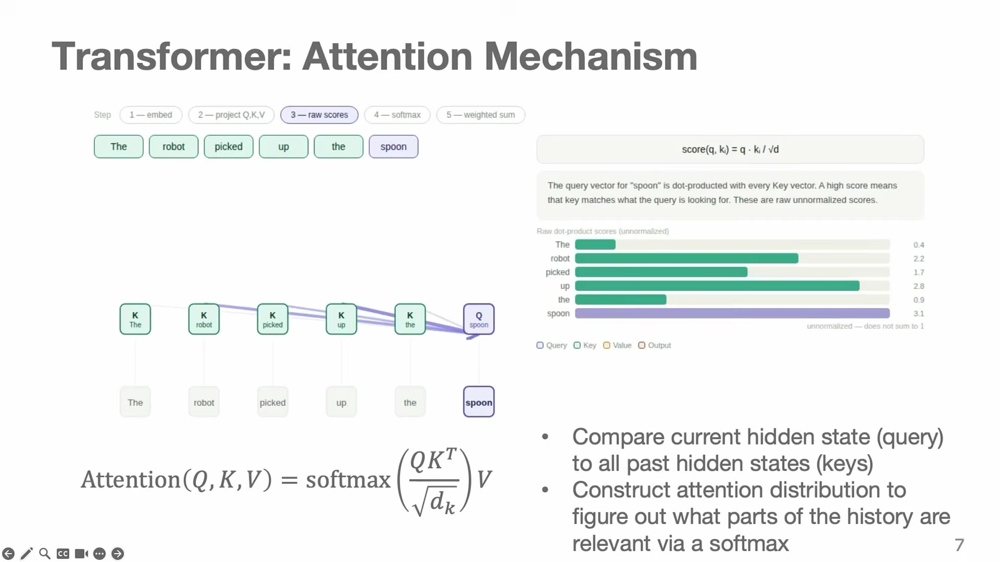
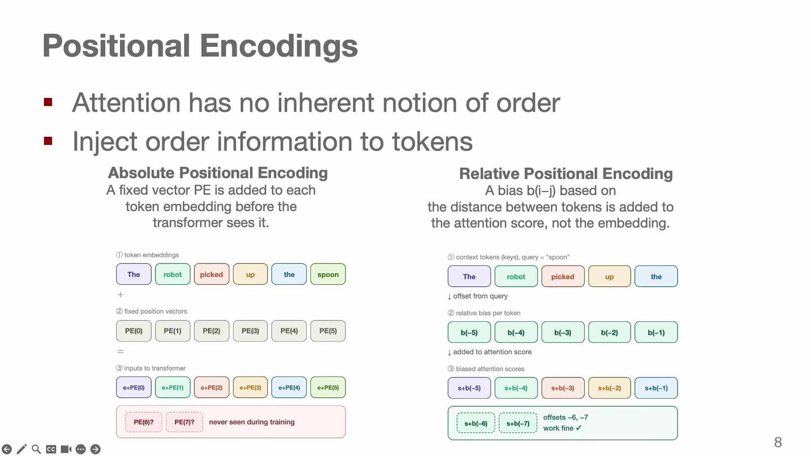
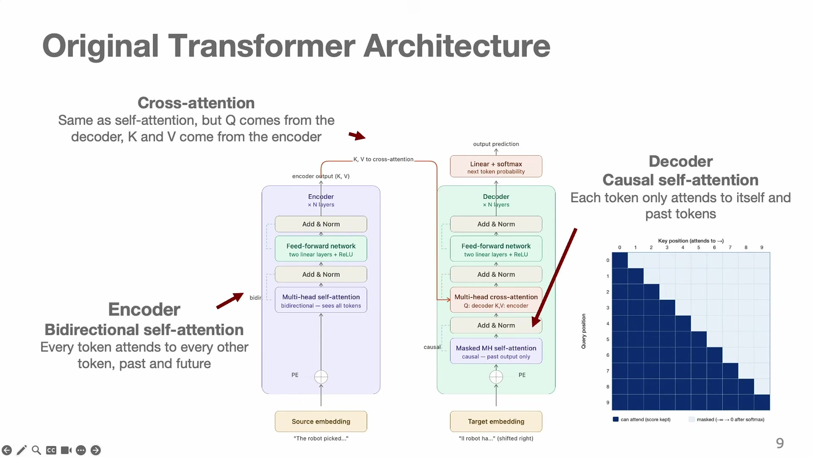
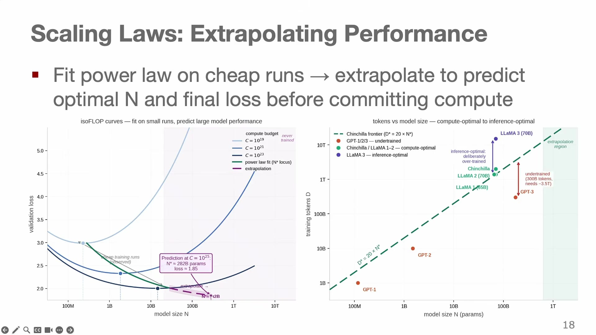
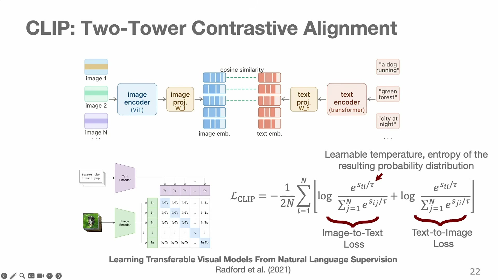
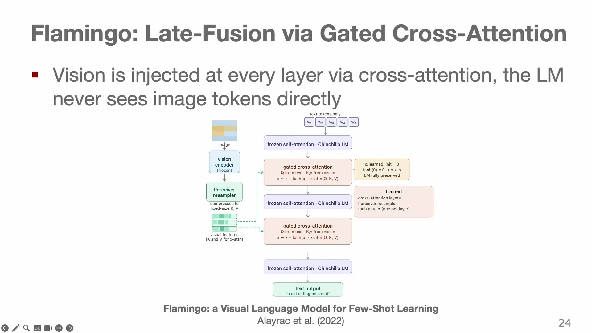
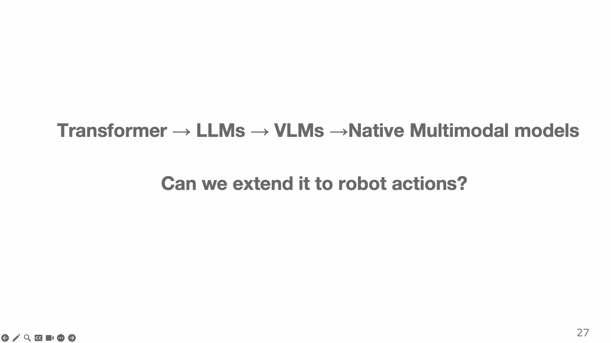
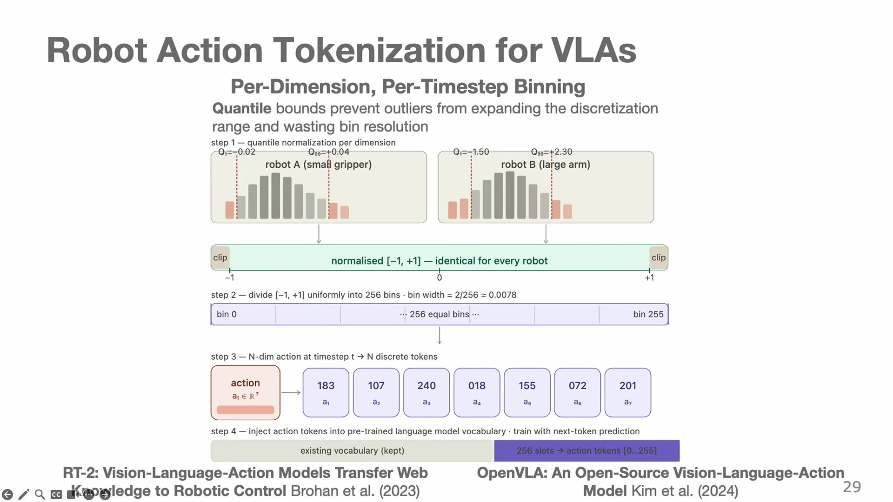
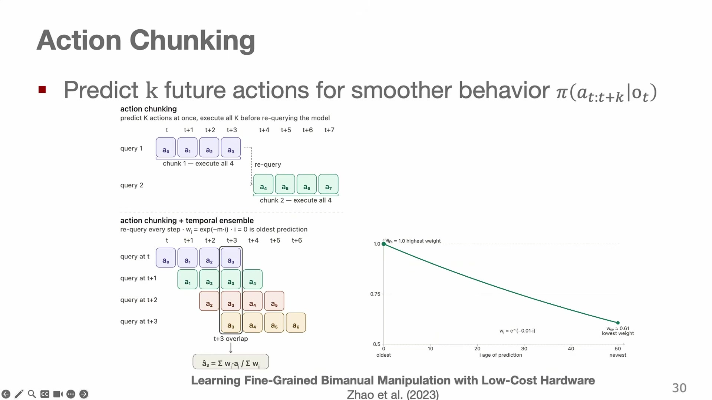
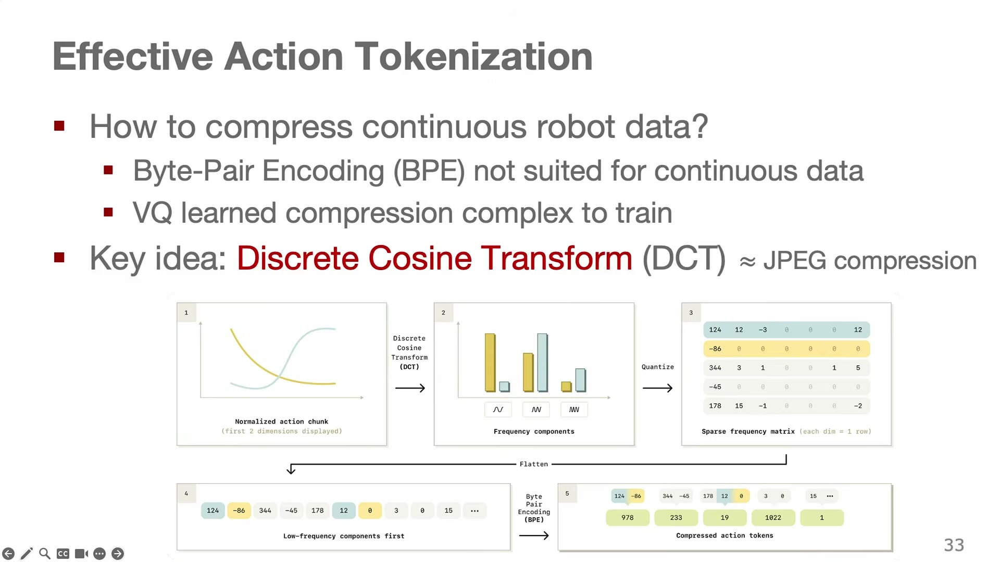

# Sequence Modeling and Transformers

Everything up to here has treated a policy as a function of the present: $\pi(a \mid o_t)$, one observation in, one action out. That formulation fails in two ways that a robot notices immediately. It has **no memory** — a single camera frame cannot tell you which way the pedestrian is walking or what you were doing ten seconds ago, which is Chapter 2's state-versus-observation problem showing up as a concrete defect. And it produces **jerky motion**, because deciding one step at a time gives no reason for consecutive decisions to be smooth. Both problems disappear if the policy stops predicting a single action and starts modelling the whole sequence

$$\tau = (o_0, a_0, o_1, a_1, \ldots).$$

That change of object is what this chapter is about, and it is the hinge of the book. Once robotics is a sequence-modelling problem, robotics inherits the architectures, the pretraining recipes and the scaling laws that language and vision spent a decade developing. The chapter walks that inheritance in order: the architecture, the tokenization, the scaling, the extension to images, and finally what has to change to make actions fit.

The through-line is a claim the lecture keeps returning to, Sutton's **bitter lesson**: methods that scale with compute beat methods with hand-engineered structure, given enough compute. Every step below is a case of it.

## Autoregressive models and the limits of recurrence

Any joint distribution over a sequence factorizes into conditionals, exactly as Chapter 3's per-dimension action model did:

$$p_\theta(x) = \prod_{t=1}^{T} p_\theta\big(x_t \mid x_{1:t-1}\big)$$ {#eq:chainrule}

**In words.** The probability of a whole sequence is the probability of its first element, times the probability of the second given the first, and so on.

**The symbols.** $x_{1:t-1}$ is the prefix of the sequence before position $t$.

**Why this shape.** The factorization is exact, so nothing is lost, and it converts "model a distribution over sequences" into "predict the next element" — a supervised problem with as many training examples as there are positions. Everything in this chapter, and every large language model, is an implementation of @eq:chainrule.

The pre-2017 implementation was the **recurrent neural network**, which carries a hidden state forward: $h_t = f(h_{t-1}, x_t)$, summarizing all history in a fixed-size vector, and handling variable-length sequences naturally. It had three problems, and they are worth naming because attention solves all three at once.

**Long-range dependencies.** To connect position 1 to position 100, gradients must pass through 99 intermediate steps, multiplying by a Jacobian each time; the product either explodes or vanishes. LSTMs, with gates that let information pass unchanged, help substantially and do not solve it.

**Poor parallelism.** $h_t$ depends on $h_{t-1}$, so the sequence must be processed in order. On hardware built for parallel arithmetic, that is the expensive kind of dependency.

**A fixed-size bottleneck.** All of history is compressed into one vector of fixed width, whatever the sequence length.

The quantity that summarizes the first problem is the **path length** between two positions: in an RNN it is $O(n)$ steps for a sequence of length $n$.

## Attention

Attention replaces recurrence with direct, equal-cost access between any two positions — a path length of $O(1)$. For each position, compare its query against every key, normalize the comparisons, and take the correspondingly weighted average of the values:

$$\mathrm{score}(q,k) = \frac{q \cdot k}{\sqrt{d}}, \qquad \mathrm{Attention}(Q,K,V) = \mathrm{softmax}\!\Big(\frac{Q K^\top}{\sqrt{d}}\Big) V, \qquad \text{output}_i = \sum_j a_{ij}\,v_j$$ {#eq:attention}

**In words.** Every position asks a question, every position advertises what it has, and each position's output is a blend of everything on offer, weighted by how well the offer answers the question.

**The symbols.** $Q$, $K$ and $V$ are matrices whose rows are the queries, keys and values for each position, each obtained by a learned linear projection of the input. $d$ is the dimension of a key. $a_{ij}$ is the attention weight from position $i$ to position $j$, the $(i,j)$ entry of the softmax output, and $v_j$ is the $j$-th value.

**Why this shape.** The mechanism is a **soft, differentiable dictionary lookup**: a hard lookup would retrieve the single value whose key matches the query, and attention retrieves all of them blended by match quality — which is what makes it differentiable and therefore learnable. The division by $\sqrt{d}$ is not cosmetic: the dot product of two $d$-dimensional vectors with unit-variance entries has variance $d$, so without the scaling the softmax's inputs grow with dimension, its output saturates to a one-hot vector, and gradients vanish. The deeper point is what is being learned. A convolutional network learns features over a fixed neighborhood structure; attention learns the features *and* the structure — which positions should talk to which — from data. That is the bitter lesson in one architecture (@fig:attention).

{#fig:attention width=78%}

One cost, which will matter for robotics: computing $QK^\top$ is **quadratic** in sequence length. Every decision about tokenization downstream is partly a decision about how much of this quadratic cost to pay.

### Positional encoding

@eq:attention has no notion of order. It is a set operation: permute the inputs and the outputs permute with them, unchanged. So "robot picked up spoon" and "spoon picked up robot" are the same input, which is not acceptable.

Position must therefore be injected. The original approach is **absolute**: add a fixed vector $\mathrm{PE}(i)$, depending only on the index, to each position's embedding. It works and it generalizes badly — a model trained on sequences of length 512 has never seen $\mathrm{PE}(900)$ and has no principled way to interpret it. The **relative** approach adds a bias $b(i-j)$ to the attention score, depending only on the *distance* between positions. Since distances recur at every length, this extrapolates to sequences longer than those seen in training, which is why relative schemes won (@fig:pe).

{#fig:pe width=78%}

## The original transformer, and the parts that survived

The transformer was built for translation, which is why it began as an **encoder-decoder**. The encoder uses **bidirectional self-attention** — every token sees every other, past and future — because when the whole source sentence is available there is no reason to restrict it, and unrestricted attention gives the richest representation.

The decoder cannot do that, since it generates left to right and must not see the answer. It uses **causal self-attention**: before the softmax, a triangular mask sets the score of every future position to $-\infty$, so those weights become zero. Each token attends to itself and its predecessors only. This one modification is what makes autoregressive generation possible, and it is the single most consequential line of code in modern machine learning.

**Cross-attention** sits between them: the decoder supplies queries, the encoder supplies keys and values, so the decoder can ask "what in the source is relevant to what I am writing now?"

Training is **teacher forcing**: feed the ground-truth prefix rather than the model's own predictions, and maximize the likelihood of each next token:

$$\mathcal{L} = -\frac{1}{T}\sum_{t=1}^{T} \log p_\theta\big(x_t \mid x_{1:t-1}\big)$$ {#eq:teacherforcing}

**In words.** At every position, penalize the model for the probability it failed to assign to the token that actually came next.

**Why this shape.** With the causal mask in place and the true prefix supplied, all $T$ predictions can be computed and scored in **one forward pass**, because position $t$'s prediction depends only on inputs the model already has. An RNN needs $T$ sequential passes for the same thing. That is the parallelism advantage that made scale possible, and it is worth noting that it is a consequence of the mask rather than of attention per se (@fig:transformer).

{#fig:transformer width=80%}

## Tokenization: choosing the unit

A sequence model needs a vocabulary of discrete units. Two obvious choices are both bad. **Characters** give a tiny vocabulary and very long sequences, which the quadratic cost of attention punishes. **Words** give short sequences and a vocabulary that can never be complete, since any unseen word is unrepresentable.

**Byte-pair encoding** finds the middle. Start with characters, count all adjacent pairs in the corpus, merge the most frequent pair into a new symbol, and repeat $k$ times.

\begin{algorithm}[H]
\caption{Byte-pair encoding (vocabulary construction)}
\KwIn{corpus, number of merges $k$}
\KwOut{a vocabulary of subword units}
initialize the vocabulary with all individual characters\;
\For{$k$ times}{
  count the frequency of every adjacent pair of symbols in the corpus\;
  merge the most frequent pair into a single new symbol and add it to the vocabulary\;
}
\end{algorithm}

**Why this shape.** Frequent letter sequences merge early, so common words end up as single tokens and rare ones decompose into familiar pieces — which means **nothing is ever out of vocabulary** while sequences stay short. The lecture's example: a 54-character string becomes 34 tokens, a **37% reduction**, and the compression improves with corpus size because more merges become worthwhile. Production language models use 50,000–100,000 tokens and achieve roughly 3–4 characters per token. The reason to care about a few percent here is @eq:attention's quadratic cost: halving the sequence length quarters the attention computation.

Remember this algorithm. It reappears at the end of the chapter, applied to robot actions.

## Scaling to language models

Four engineering changes turned the translation architecture into something that scales.

**Decoder-only.** Drop the encoder and run a single causal stack on next-token prediction. Fewer moving parts, one objective, better scaling.

**Byte-level BPE.** Run the merges over raw bytes rather than characters, so any possible input — including emoji and every script — is representable with no unknown token at all.

**Rotary position embeddings.** Rotate the query and key vectors by an angle proportional to position, so that their dot product depends only on the difference in position. This gets the extrapolation benefit of relative encoding without adding a bias term.

**FlashAttention.** Compute attention in tiles that stay in fast on-chip memory, never materializing the $n \times n$ score matrix. The arithmetic is unchanged; the memory cost drops from quadratic to linear, which is what made long contexts affordable.

The trajectory that followed is the bitter lesson stated as a sequence of model releases. **GPT-1** (2018) established pre-train-then-fine-tune. **GPT-2** (2019), ten times larger, could do tasks **zero-shot** — with no fine-tuning at all. **GPT-3** (2020), at 175 billion parameters trained on 300 billion tokens, showed **in-context learning**: give it a few examples in the prompt and it generalizes, an ability nobody designed, which appeared as a function of scale.

### Scaling laws

If scale is the lever, how should a fixed compute budget be spent — a bigger model or more data? The **Chinchilla** result answers it: scale both, equally.

$$N^* \propto C^{0.5}, \qquad D^* \propto C^{0.5}, \qquad C \approx 6 N D, \qquad \frac{D^*}{N^*} \approx 20$$ {#eq:chinchilla}

**In words.** For a given amount of compute there is one best model size and one best dataset size, they grow at the same rate, and the ratio works out to about twenty training tokens per parameter.

**The symbols.** $N$ is the number of model parameters, $D$ the number of training tokens, $C$ the compute budget in floating-point operations, and the starred quantities the compute-optimal choices.

**Why this shape.** The factor of 6 in $C \approx 6ND$ is accounting: roughly 2 operations per parameter per token in the forward pass and 4 in the backward pass. The rest is empirical — fit a surface to many training runs and read off the minimum. The practical consequence is that **you can predict a large model's loss from a set of cheap small runs**, by fitting a power law along curves of constant compute and extrapolating. That is what turned training frontier models from a gamble into a budgeting exercise.

**Worked example: was GPT-3 the right size?** GPT-3 had $N = 175$ billion parameters and was trained on $D = 300$ billion tokens, a ratio of

$$\frac{D}{N} = \frac{300}{175} \approx 1.7 \text{ tokens per parameter},$$

against the compute-optimal 20. Compute-optimally, 175 billion parameters wants $175 \times 20 = 3.5$ trillion tokens — more than **eleven times** what it received. Equivalently, at fixed compute the same budget would have been better spent on a much smaller model trained far longer. **GPT-3 was badly undertrained**, and the discovery of that is why the models that followed it were often smaller and much better.

One qualification the lecture adds, and it matters for robotics. Compute-optimal is optimal for *training*, and Llama-3 was deliberately trained well past that point — over-trained relative to Chinchilla — because when a model will serve millions of requests, the cost that dominates is **inference**, and a smaller model over-trained to the same quality is cheaper to serve forever. A robot is the extreme case of that argument: the model runs at 50 Hz on hardware you can carry (@fig:chinchilla).

{#fig:chinchilla width=78%}

## Extending to vision

To put images into a sequence model, make them a sequence. The **vision transformer** does exactly that: split a $224 \times 224$ image into $16\times16$ patches, giving $196$ patches; flatten each, project it linearly to the model's width, and add a positional encoding. The result is 196 tokens that a transformer consumes exactly as it consumes text — often plus one extra classification token, for 197 total. The philosophy is identical to byte-pair encoding: **find the right unit, embed it, and let attention discover the structure.**

Aligning vision with language then has three established answers, and the differences between them recur in every robot policy in this book.

**CLIP** trains two separate towers — a vision transformer and a text transformer — and aligns their outputs by **contrastive learning** on image-text pairs:

$$\mathcal{L}_{\text{CLIP}} = -\frac{1}{2N}\sum_i \left( \log\frac{e^{s_{ii}/\tau_c}}{\sum_j e^{s_{ij}/\tau_c}} + \log\frac{e^{s_{ii}/\tau_c}}{\sum_j e^{s_{ji}/\tau_c}} \right)$$ {#eq:clip}

**In words.** In a batch of image-caption pairs, make each image's embedding more similar to its own caption than to any other caption, and each caption's more similar to its own image than to any other image.

**The symbols.** $s_{ij}$ is the cosine similarity between image $i$'s embedding and text $j$'s; $\tau_c$ is a learned **temperature** controlling how sharply the softmax discriminates; $N$ is the batch size. The two terms are the two directions of the matching problem.

**Why this shape.** The loss is a softmax cross-entropy over the $N \times N$ similarity matrix, with the diagonal as the correct answer — so the negatives are free, supplied by the other items in the batch, which is why contrastive learning scales with batch size. Symmetrizing matters because a one-directional loss can be satisfied degenerately. The outcome is a shared embedding space in which the picture of an apple and the word "apple" land near each other, and that shared space is what allows a robot policy to accept a language instruction and a camera image as comparable objects (@fig:clip).

{#fig:clip width=78%}

**LLaVA and early fusion.** Take a frozen CLIP vision encoder, add a small trainable projection, and **prepend** the resulting image tokens to the text tokens. A pre-trained language model then runs one ordinary self-attention pass over the concatenated sequence — no new attention mechanism, no architectural surgery. Fine-tune on visual instruction data and you have a vision-language model. Chapter 9 shows this exact recipe turning into a robot policy by substituting action tokens for text tokens.

**Flamingo and late fusion.** Keep the language model's own layers untouched and insert new **gated cross-attention** blocks between them, through which text queries attend to a fixed-size set of visual keys and values produced by a perceiver resampler. The elegant detail is the gate:

$$x \leftarrow x + \tanh(\alpha)\cdot\mathrm{crossattn}(Q,K,V), \qquad \alpha \text{ learned, initialized to } 0$$ {#eq:flamingo}

**In words.** Add the visual contribution through a valve that starts fully closed and opens only as training finds it useful.

**The symbols.** $\alpha$ is a learned scalar per gate, initialized at zero; $\tanh(0) = 0$.

**Why this shape.** At initialization the new blocks contribute exactly nothing, so the model *is* the original language model — no degradation, no destructive interference — and training opens the valve gradually. This is a general trick for adding a modality to a pre-trained network without breaking it, and Chapter 9's knowledge-insulation stop-gradient is the same instinct applied at a different point (@fig:flamingo).

{#fig:flamingo width=78%}

**Native multimodality.** Train on all modalities jointly from scratch, interleaved in any order — the most flexible and the most expensive, and Chapter 11 returns to it as the obvious-looking answer to robot sensing that founders on data scarcity.

The trade-off across the three is worth tabulating, because Chapter 9's policies are built from exactly these choices:

| | Early fusion (LLaVA) | Late fusion (Flamingo) | Native multimodal |
|---|---|---|---|
| Where vision enters | prepended to the input sequence | new cross-attention blocks at every layer | everywhere, from the start |
| Language model | fine-tuned | frozen | trained from scratch |
| Cross-modal mixing | richest — one joint attention pass | limited to the inserted blocks | unrestricted |
| Main risk | degrading the pre-trained language model | modalities interact too little | cost, and needing all the data at once |
| Cost | lowest | moderate | highest |

> **Editor's note.** The lecture adds a piece of provenance that is worth recording: the lecturer overlapped in Freiburg with **Alexey Dosovitskiy**, the first author of the vision-transformer paper, and with **Lucas Beyer**, one of its co-authors, who gives a guest lecture in the final week of the course. The patch-embedding idea in this section and the person discussing open problems in Chapter 11 come from the same lab corridor.

## Robotics as multimodal sequence modeling

Now the substitution this book has been building toward since Chapter 1. Language tokens, image tokens — and **action tokens**, in the same sequence, under the same next-token objective, with no change to the architecture. Attention also disposes of the memory problem this chapter opened with, since the policy can simply attend over its history (@fig:robotseq).

{#fig:robotseq width=78%}

Three problems have to be solved to make actions behave like tokens.

### Action tokenization

Actions are continuous, so they must be discretized. The scheme used by RT-2 and OpenVLA has three parts, each fixing a defect of the obvious approach.

**Quantile normalization.** Per action dimension, clip to the 1st and 99th percentile of the training data and map that range to $[-1,+1]$. The alternative — min-max normalization, as RT-2 used — lets a single outlier stretch the range so that the bins covering ordinary motion are wasted. Using quantiles also makes the normalized scale comparable across robots with different physical limits, which is what Chapter 9 needs.

**Binning.** Divide $[-1,+1]$ into **256 bins**, so each bin has width

$$\frac{2}{256} = 0.0078,$$

and an $n$-dimensional action becomes $n$ discrete tokens.

**Vocabulary injection.** Rather than growing the model's output layer, **overwrite the 256 least-frequent tokens** of the existing vocabulary with action tokens. The model's architecture is untouched; it simply learns that in this context those token IDs mean motion. Training is next-token prediction with the same cross-entropy loss as text.

This is Chapter 3's autoregressive discretization, now with the engineering details that make it work at scale (@fig:actiontok).

{#fig:actiontok width=80%}

### Action chunking

The smoothness problem needs a different fix: predict several future actions at once.

$$\pi_\theta\big(\mathbf{a}_{t:t+H} \mid o_t\big)$$ {#eq:chunk}

**In words.** From one observation, output a short plan of the next $H$ actions, execute it, and then look again.

**The symbols.** $H$ is the chunk length.

**Why this shape.** Motion is fluid because all $H$ actions are planned together and are therefore consistent with one another, rather than being $H$ independent decisions that happen to follow each other. The cost is being **blind for the duration of the chunk**. The numbers make this vivid: ACT predicts 100 actions at a time for a bimanual ALOHA at 50 Hz, which is $14 \times 100 = 1{,}400$ values from a single forward pass, and

$$\frac{100\ \text{steps}}{50\ \text{Hz}} = 2\ \text{seconds}$$

during which the robot ignores the world. Two seconds is long enough for the object to move.

**Temporal ensembling** recovers reactivity without giving up smoothness. Re-query every step, so at any moment several past chunks have predictions for the current timestep, and combine them with exponentially decaying weights:

$$w_i = \exp(-m\,i), \qquad \hat a_t = \frac{\sum_i w_i\,a_i}{\sum_i w_i}$$ {#eq:ensemble}

**In words.** Average the predictions that several recent plans make for right now, trusting the freshest one most.

**The symbols.** $a_i$ is the prediction for the current timestep made by the chunk issued $i$ steps ago, $w_i$ its weight, and $m$ the decay rate.

**Why this shape.** Averaging over plans smooths the output, and the exponential decay is what keeps it reactive: the newest chunk — which has seen the most recent observation — dominates, while older chunks contribute a diminishing amount of continuity. The single parameter $m$ interpolates between "ignore history", at large $m$, and "ignore the present", at small $m$. ACT is at its best on high-precision tasks like inserting a battery, where exactly this combination of steadiness and responsiveness is required (@fig:chunk).

{#fig:chunk width=80%}

### Why naive tokenization breaks at high frequency, and FAST

The third problem is the subtle one, and it is where robot actions stop behaving like language.

Raise the control frequency and consecutive actions become more similar, because less happens between them. At 50 Hz, the next action token is almost always the same as the current one. The marginal information in each token approaches zero, and a next-token predictor trained on that data learns the cheapest available rule: **copy the previous token.** It achieves excellent token accuracy and has learned nothing about the task. Empirically, naive per-dimension binning degrades past about **5 Hz** — which is far below the frequency dexterous manipulation needs.

What is required is compression: the same problem byte-pair encoding solved for characters, where the fix was to stop modelling units that carry almost no information alone. BPE cannot be applied directly to continuous values, and VQ-VAE — Chapter 6's answer — works but adds a trained component with its own failure modes.

**FAST** borrows from JPEG instead. Apply the **discrete cosine transform** to each action dimension over the chunk, which represents the trajectory as a sum of frequency components; because real trajectories are smooth, almost all the energy lands in a few low-frequency coefficients and the rest are near zero. Round the coefficients, flatten them low-frequency-first, and run **byte-pair encoding on the resulting integers**. The output is a short, dense token sequence for the existing vocabulary.

**Why this shape.** Each step earns its place. The DCT concentrates a smooth signal into few numbers, which is exactly the redundancy that was defeating the tokenizer. Quantization discards the near-zero high frequencies, which are mostly sensor noise. Ordering low-frequency-first means the important coefficients come early and the tail is mostly zeros, which is what BPE compresses well. And the result is *tokens*, so nothing about the model or its vocabulary changes.

The results settle the question. Performance keeps improving past 5 Hz rather than degrading. **π₀-FAST** — the autoregressive version of Chapter 6's flow-matching model, on a vision-language backbone — **converges about five times faster** than its flow-matching counterpart. Trained on the DROID dataset, it performed language-specified tasks **zero-shot in kitchens it had never seen**, at three different universities, and folded laundry bimanually at 50 Hz. That last point is the one to hold onto: generality and dexterity are usually in tension — ACT is precise and narrow, OpenVLA is broad and clumsy — and this is a case of pushing both at once (@fig:fast).

{#fig:fast width=80%}

## Where this breaks

**Attention is quadratic, and robot sequences are long.** Every token costs, and a policy that attends over a history of images pays the square of that history. FlashAttention makes the memory linear and leaves the arithmetic quadratic. Chapter 8 hits this wall hard enough to need a whole section on video compression, and Chapter 11 names the context-length bottleneck as a reason a unified navigation-and-manipulation model does not yet exist.

**Tokenization is a lossy modelling choice pretending to be preprocessing.** 256 bins per dimension caps the achievable precision at 0.0078 of the normalized range, whatever the model does. Quantile clipping discards the top and bottom percentile of the data, which is where fast corrective motions live. FAST's rounding throws away high frequencies, which is right for smooth trajectories and wrong for impacts. None of these choices is visible in the loss.

**Chunking trades reactivity for smoothness, and the trade cannot be avoided.** Temporal ensembling softens it, at the cost of an extra forward pass per step and a decay parameter with no principled setting. A long chunk is smooth and blind; a short chunk is responsive and jerky.

**Scaling laws were derived for text and are assumed for robots.** @eq:chinchilla came from language-model runs. Nobody has established the equivalent for robot data, and there is a good reason to doubt the transfer: Chapter 9 shows that robot datasets are heterogeneous mixtures of different embodiments, so "number of tokens" is not the meaningful axis it is for text.

**The bitter lesson is invoked more often than it is tested.** The argument that general architectures plus scale beat hand-engineered structure is well supported in language and vision, and robotics does not yet have the data for the experiment. Chapter 11 records this as an open dispute among three camps rather than a settled question, and the honest position is that robotics is applying a lesson learned in a domain with a hundred thousand times more data.

## What this connects to

**Backwards.** @eq:chainrule is Chapter 3's autoregressive multimodality tool, developed properly; action tokenization is that tool's engineering. The memory problem this chapter opened with is Chapter 2's observation-versus-state distinction, and attention over history is the field's answer to it. Chapter 6 supplied the piece that makes any of this possible for continuous data — quantization — and Chapter 6's diffusion and flow-matching heads are the alternative to tokenizing actions at all, which is why Chapter 9 has to choose between them.

**Forwards.** Chapter 8's world models are sequence models over video, and they inherit both the architecture and the tokenization problem in a harsher form, since a video is many images. Chapter 9 is this chapter applied at scale: Octo is a transformer over task, observation and readout tokens; the vision-language-action recipe is LLaVA's early fusion with actions substituted for text; and FAST is the tokenizer in the current standard recipe. Chapter 10 takes the same architecture and inserts *reasoning* tokens between the observation and the action, which works and costs an order of magnitude in inference speed — the direct consequence of the token budget this chapter established.

One thread is worth naming explicitly. **The unit you choose to model is a design decision with consequences all the way down.** Characters versus subwords, pixels versus patches, per-timestep bins versus frequency coefficients: in each case the field's progress came from choosing a better unit rather than a better model. That pattern is the most transferable thing in this chapter.

## Further reading

- **T. Zhao, V. Kumar, S. Levine and C. Finn, "Learning Fine-Grained Bimanual Manipulation with Low-Cost Hardware" (2023).** The ACT paper, and the source of this chapter's chunking and temporal-ensembling equations. Read it for the demonstration that a modest transformer plus the right output structure beats far more elaborate methods on precise bimanual tasks, and for the hardware, since the low-cost bimanual setup it introduced is now standard.
- **L. Chen, K. Lu, A. Rajeswaran et al., "Decision Transformer: Reinforcement Learning via Sequence Modeling" (2021).** Reinforcement learning recast entirely as this chapter's problem: feed a sequence of returns, states and actions to a causal transformer and predict the next action, conditioning on the return you want. Read it against Chapters 4 and 5 as a claim that the value machinery might be replaceable by sequence modelling and a good conditioning variable.
- **I. Radosavovic, B. Zhang, B. Shi et al., "Humanoid Locomotion as Next Token Prediction" (2024).** The same idea taken to a domain where it should not work — a real humanoid walking, controlled by a next-token predictor trained partly on incomplete trajectories with missing actions. Read it as the strongest available evidence for this chapter's central claim, since locomotion is where model-based control is strongest and a generic sequence model has the least right to succeed.
